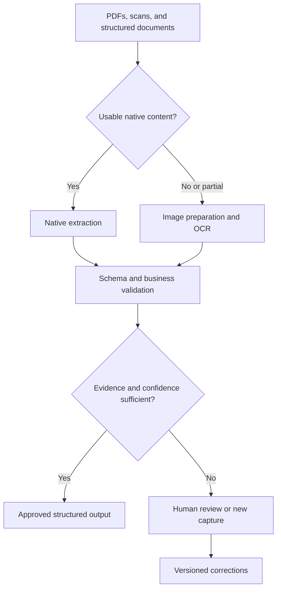

# AtharDoc

**Document intelligence. Every field traced.**

AtharDoc is a project for self-hosted, multilingual document intelligence: turning PDFs, scans, and document images into structured data with source evidence, calibrated confidence, and human review.

The initial focus is supplier document reconciliation—delivery notes, invoices, and purchase orders—with French, English, and Arabic as target languages to evaluate.

> **Status: research and architecture.** This repository currently contains the engineering dossier and product roadmap. The application, API, model integrations, and deployment packages are not implemented yet. No production accuracy or throughput is claimed.

## MVP design

**[Read the MVP system design](docs/product/MVP_SYSTEM_DESIGN.md)** — a proposed three-week implementation plan for invoice upload, extraction with source evidence, human review, and approved JSON/CSV export.

The design includes screens, architecture, field and API contracts, the data model, worker recovery, deployment assumptions, release criteria, and a day-by-day backlog. Delivery-note linking is a stretch milestone; automatic approval and full reconciliation follow measured validation.

The MVP uses a GLM-OCR adapter as its implementation baseline while retaining the dossier's broader model evaluation strategy. This is a design milestone; implementation has not started.

## Engineering dossier

Read the full French-language dossier:

**[Construire un système documentaire à 99 % d’exactitude](docs/architecture/OCR_99_Dossier_ingenierie_2026-09-14.md)**  
Research snapshot: **14 September 2026**.

The dossier covers:

- OCR and document model comparisons, licenses, and benchmark limitations.
- A statistical accuracy contract, confidence calibration, and human review.
- A proposed architecture, GPU sizing, and deployment approach.
- Target markets, use cases, and initial product positioning.
- A fine-tuning runbook with example scripts and configurations.
- Risks, a 30/60/90-day execution plan, and cost scenarios.

It distinguishes sourced facts, author-reported results, inferences, and estimates. Its training configurations and hardware assumptions require validation on representative data.

## Product direction

AtharDoc is designed around five principles:

1. **Traceable extraction.** Link critical fields to their source page and region.
2. **Selective automation.** Automatically approve documents only when evidence and validation support the decision; route uncertain cases to review.
3. **Self-hosted processing.** Target EU-hosted or isolated deployments, with local model inference.
4. **Business validation.** Check document structure, field consistency, and reconciliation rules.
5. **Measured quality.** Track document accuracy, automation coverage, review effort, latency, and total cost together.

Planned capabilities include native PDF/XML parsing, OCR, layout and table extraction, structured field extraction, a review interface, and an integration API.

## Proposed processing flow

The dossier proposes PaddleOCR-VL 1.6 as the primary candidate, GLM-OCR for adaptation experiments, and OvisOCR2 as an independent parsing challenger. These are research choices, pending internal evaluation and verification of the complete model bundles.

## What “99%” means

The dossier proposes a target for **documents automatically approved within a defined scope**: a one-sided 95% confidence lower bound of at least 99% document accuracy, with automation coverage reported alongside it.

This is an acceptance criterion to test. It is not a measured result, a universal OCR accuracy claim, or a promise that every document will be processed automatically.

## Roadmap

| Phase | Planned outcome |
| --- | --- |
| Days 1–30 | Define critical fields and acceptance criteria; collect and annotate representative documents; benchmark baseline pipelines. |
| Days 31–60 | Build extraction, validation, and review workflows; run adaptation experiments where justified; measure latency and cost. |
| Days 61–90 | Validate the frozen pipeline on an independent test set; run a bounded pilot; prepare deployment and operational monitoring. |

Progress depends on access to representative documents, reliable annotations, review capacity, and measured GPU performance.

## Getting started

Start with the [MVP system design](docs/product/MVP_SYSTEM_DESIGN.md) for the build plan. Read the [engineering dossier](docs/architecture/OCR_99_Dossier_ingenierie_2026-09-14.md), particularly the proposed decision, accuracy contract, architecture, and execution plan.

The fine-tuning section includes example code and configuration. These examples are embedded in the document; they are not an installed SDK or a validated training environment. There is no application installation command yet.

## Contributing

Use [issues](https://github.com/HoucineDev/AtharDoc/issues) to discuss implementation proposals, benchmark methodology, or documentation corrections.

For benchmark contributions, include the model revision, dataset provenance and usage rights, hardware, evaluation protocol, and observed failure cases. Keep customer documents and credentials out of public issues and commits.

## Licensing

No project license has been selected yet. Third-party models, datasets, and dependencies retain their own licenses and must be reviewed before use or redistribution.

---

**Documentation en français :** le dossier présente les choix techniques, le contrat de qualité, les hypothèses économiques et le plan de mise en œuvre d’AtharDoc.
