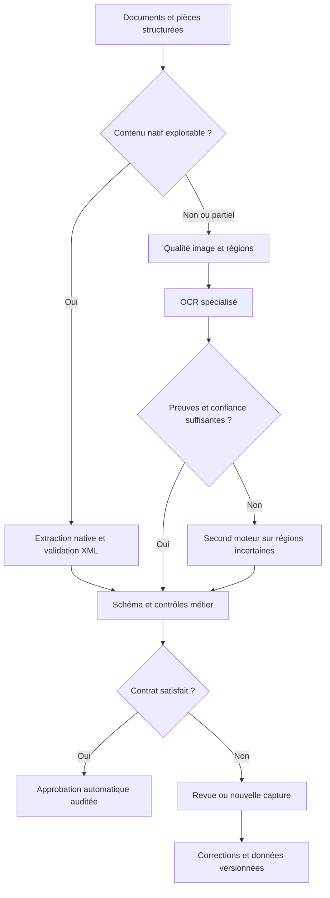

# Construire un système documentaire à 99 % d’exactitude

## 0 — Décision proposée

**[INFERRED] Construire un système d’extraction sélective et traçable : parsing natif, pipeline OCR spécialisé, contrôles métier, calibration au niveau document et abstention.** Commencer par un seul vertical : rapprochement de bons de livraison et factures fournisseurs. Retenir **PaddleOCR-VL 1.6 comme candidat principal**, **GLM-OCR comme candidat d’adaptation**, et **OvisOCR2 comme challenger indépendant au niveau du parsing**. Leur sélection définitive dépend du test interne, pas de leur rang public. Les cartes officielles établissent respectivement des poids Apache-2.0, MIT et Apache-2.0 ; les modèles auxiliaires restent à inventorier. [Paddle](https://huggingface.co/PaddlePaddle/PaddleOCR-VL-1.6), [GLM](https://huggingface.co/zai-org/GLM-OCR), [Ovis](https://huggingface.co/ATH-MaaS/OvisOCR2).



| Décision | Choix initial [INFERRED] | Argument contre / condition d’abandon |
|---|---|---|
| Définir 99 % | Borne inférieure unilatérale à 95 % de l’exactitude des documents auto-approuvés ≥99 %, avec couverture publiée | Inadapté à un processus qui interdit toute revue et exige 100 % de couverture ; réduire alors le périmètre ou refuser le SLA |
| Choisir le matériel | Louer d’abord 1 GPU 48 Go pour benchmark/LoRA ; tester ensuite 24 Go pour serving ; 2 nœuds pour disponibilité | Le 48 Go peut être inutile à faible charge ; acheter un H100 sans débit mesuré immobilise du budget |
| Choisir le produit | API et écran de contrôle pour documents fournisseurs, preuves visuelles et rapprochement ERP | Mauvais choix sans accès à des documents réels ni sponsor comptabilité/logistique |

**[ESTIMATE ±large] Objectif pilote, non performance prédite :** ≥99 % sur 60–80 % des documents auto-approuvés d’un vertical imprimé cadré ; aucune prévision fiable pour le mélange complet français/arabe/manuscrit/plans. À 300 000 pages/mois, scénario central : **8 €/1 000 pages de plateforme machine**, **50 € de revue**, **12 € de maintenance ingénieur**, soit **70 €/1 000 pages récurrents**. Avec amortissement de lancement : **77,2 €/1 000 pages**. Les hypothèses, la sensibilité et les exclusions figurent en G.3. Le risque majeur est une **erreur critique acceptée avec confiance**, notamment un montant ou une référence plausible mais non visible.

### 0.1 — Périmètre, hypothèses et statut des preuves

| Variable | Hypothèse de travail [ESTIMATE], à remplacer par mesures |
|---|---|
| Date d’arrêt | 14 septembre 2026 ; fenêtre de fraîcheur demandée : 14 mars–14 septembre 2026 |
| Hébergement | Exécution, données, revue, journaux et sauvegardes en UE ; fonctionnement réseau fermé possible ; aucune API OCR cloud externe dans la chaîne de production |
| Équipe / délai | Un ingénieur IA ; MVP 3 semaines ; production limitée à 2 mois si données et reviewers disponibles |
| Scénarios | S : 1 000 pages/jour ; M : 10 000 ; L : 100 000 ; 30 jours de traitement/mois ; rafale 5× pendant une heure |
| Mix pour dimensionnement | 60 % factures/BL imprimés, 20 % formulaires administratifs, 10 % photos difficiles, 5 % manuscrit, 5 % autres ; 70 % FR, 15 % EN, 10 % AR, 5 % mixte/Darija. Distribution hypothétique, pas connaissance du trafic |
| Latence | Objectif pilote p95 ≤10 s/page admissible hors revue ; délai lot de 10 000 pages ≤8 h ; pages longues asynchrones |
| Revue humaine | Supposée disponible chez le client ; 20 % central, 10–40 % en sensibilité ; 30 s/page revue, 30 €/h |
| Taille document | Modèle financier en pages équivalentes ; exemple central document d’une page. Convertir explicitement pour dossiers multipages |

**Convention de preuve.** `[FACT]` = contenu effectivement lu dans une source primaire ou résultat mathématique calculé ; `[SELF-REPORTED]` = annonce/mesure des auteurs, non reproduite ici ; `[INFERRED]` = décision ou déduction ; `[ESTIMATE ±…]` = hypothèse budgétaire/expérimentale. `ND` = non déterminé, sans substitution par une valeur inventée. Les objectifs contractuels sont des choix, pas des résultats.

**Limite de fraîcheur.** Une page consultée aujourd’hui n’est pas nécessairement publiée ou modifiée dans les six derniers mois. Les dates certaines sont indiquées ; `LIVE-ND` signale une page officielle actuelle sans date éditoriale démontrée ; `HIST` une référence historique. Ces deux statuts ne satisfont pas la règle de fraîcheur stricte. Le libellé demandé `[UNVERIFIED — from memory]` est réservé aux éléments non corroborés, pas appliqué artificiellement à un document historique réellement lu. Aucun prix, débit ni gain absent des sources n’est transformé en fait. L’état des lieux est exploitable pour lancer la validation, **pas une certification exhaustive du marché mondial au 14 septembre**.

**Contenu du dossier :** A paysage ; B contrat et confiance ; C architecture/GPU ; D marchés ; E fine-tuning ; F risques ; G exécution/coûts ; audit contradictoire ; questions ouvertes et journal de confiance. Les choix de B gouvernent C–G.

## A — État de l’art vérifié et limites de comparaison

### A.1 — Taxonomie utile à la décision

| Famille | Architecture et compromis [INFERRED] | Bonne utilisation | Limite structurante |
|---|---|---|---|
| OCR classique / CV + CTC | Détection de lignes, reconnaissance locale ; calcul proportionnel aux zones ; peu de génération libre | Gros volumes d’imprimés, identifiants, CPU | Ordre de lecture, tableaux et sémantique nécessitent d’autres modules |
| Pipeline modulaire | Layout → reconnaissance par région → relations → restitution | Documents hétérogènes avec preuves spatiales | Une région non détectée peut disparaître sans signal du reconnaisseur |
| VLM documentaire de bout en bout | Image → séquence texte/structure | Lecture globale, mise en page atypique | Décodage long, omission, invention, coordonnées parfois absentes |
| VLM généraliste | Image et instruction → réponse métier | Extraction variable et interprétation, escalade | Raisonnement plausible pouvant masquer une mauvaise lecture ; coût de génération |
| Plateforme commerciale | Moteurs + annotation + workflow + SLA | Achat d’un processus complet si contrat/hébergement compatibles | Prix par fonctionnalité, dépendance fournisseur ; API externe exclue ici |
| Spécialistes | Reconnaisseur lignes manuscrites, table, formule, MRZ, code-barres | Zones à contraintes fortes | Détection/routage et compatibilité linguistique indispensables |

[FACT] Une taille de 0,9B ne décrit pas forcément tout le pipeline : PaddleOCR-VL 1.6 associe un reconnaisseur à **PP-DocLayoutV3**. [Rapport, 2 juin 2026](https://arxiv.org/html/2606.03264v1). Ne pas comparer le temps du seul reconnaisseur avec celui d’un convertisseur PDF complet.

### A.2 — Matrice des candidats

Les tableaux A.2a–c forment une matrice jointe par identifiant. Les licences de code et de poids sont distinctes. « Commercial possible » signifie que la licence affichée le permet sous ses conditions, **pas** qu’une analyse de chaque dépendance et de chaque jeu d’entraînement est achevée. Aucune capacité manuscrit arabe n’est considérée validée sans test interne.

#### A.2a — Identité, licence, langues et maturité

| ID | Candidat vérifié / variante | Architecture / paramètres | Licence et usage commercial UE | Langues et manuscrit réellement établis | Signal de maturité / date de preuve |
|---|---|---|---|---|---|
| M01 | [PaddleOCR-VL 1.6](https://huggingface.co/PaddlePaddle/PaddleOCR-VL-1.6) | 0,9B, vision à résolution variable + petit décodeur ; pipeline layout | [FACT] Apache-2.0 ; oui sous conditions usuelles | Multilingue annoncé ; FR/AR/manuscrit à quantifier séparément | Carte et [papier 02/06/2026](https://arxiv.org/abs/2606.03264) ; documentation pipeline et serving |
| M02 | [GLM-OCR](https://huggingface.co/zai-org/GLM-OCR) | 0,9B, encodeur vision + décodeur ; layout externe | [FACT] MIT ; layout Apache-2.0 | Carte : 8 langues ; absence de preuve d’un contrat arabe manuscrit | SDK et guide LoRA ; article 11–12/03 hors fenêtre de quelques jours ; carte LIVE-ND |
| M03 | [OvisOCR2](https://huggingface.co/ATH-MaaS/OvisOCR2) | 0,8B, page → Markdown | [FACT] Apache-2.0 | Document parsing ; qualité FR/AR/manuscrit ND | [Rapport 15/07/2026](https://arxiv.org/abs/2607.13639) ; recette vLLM explicite ; recul limité |
| M04 | [TeleOCR](https://huggingface.co/StarDoc-AI/TeleOCR) | ≈1,2B, modélisation géométrique documents/photos | [FACT] Apache-2.0 affichée | Carte EN/ZH/JA ; FR/AR non établis | Poids 17/08/2026 ; NaviDC-OCR renommé 10/09 ; très récent |
| M05 | [MinerU2.5-Pro / MinerU](https://github.com/opendatalab/MinerU) | 1,2B + orchestrateur hybride/natif | [FACT] Licence custom dérivée Apache ; commerciale conditionnelle, détails ci-dessous | Toolkit annonce 109 langues ; ne vaut pas validation du même checkpoint sur 109 langues | Évolutions datées avril–juin 2026 ; backends multiples |
| M06 | [dots.mocr](https://huggingface.co/dots-studio/dots.mocr) | 3B, texte et graphiques ; successeur de dots.ocr-1.5 | [FACT] MIT affichée | Multilingue annoncé ; arabe manuscrit ND | Renommage confirmé [19/03/2026](https://github.com/studio-dots-ai/dots.ocr) |
| M07 | [DeepSeek-OCR-2](https://github.com/deepseek-ai/DeepSeek-OCR-2) | 3B ; compression/perception visuelle causale | Licence à vérifier pour les poids exacts ; pas de feu vert juridique donné ici | EN/ZH documentés principalement ; transfert FR/AR ND | Dépôt accessible LIVE-ND ; baseline de recherche, pas priorité métier |
| M08 | [HunyuanOCR 1.5](https://github.com/Tencent-Hunyuan/HunyuanOCR) | Petit VLM documentaire + draft optionnel ; nombre exact du bundle ND | **[FACT] Licence territoriale excluant UE : éliminé de la production** | Parsing, spotting et extraction annoncés ; pas de validation AR interne | Sortie 07/07/2026 ; code entraînement/inférence publié ; licence contraignante |
| M09 | [MonkeyOCRv2](https://github.com/Yuliang-Liu/MonkeyOCRv2) | Backbone documentaire et petit parser ; taille totale à établir | Apache-2.0 annoncé pour v2 ; vérifier tous les poids | 17 langues annoncées via dépôt parent ; arabe/manuscrit à établir | Annonce juillet 2026 ; bundle distinct de v1 |
| M10 | [Dolphin-v2](https://github.com/ByteDance/Dolphin) | 3B ; classification/type, layout puis régions/page | Texte exact de licence ND ; pas approuvé pour prod à ce stade | Natif et photographié annoncés ; FR/AR ND | Sortie 12/12/2025 HIST ; dépôt LIVE-ND |
| M11 | [Logics-Parsing-v2](https://huggingface.co/Logics-MLLM/Logics-Parsing-v2) | 4B selon benchmark | Licence des poids ND ; bloque adoption commerciale | Support détaillé ND | Carte consultée ; classement public daté mars/septembre 2026 |
| M12 | [Qwen3-VL-8B-Instruct](https://huggingface.co/Qwen/Qwen3-VL-8B-Instruct) | 8B, VLM généraliste | Apache-2.0 affichée ; vérifier snapshot | [SELF-REPORTED] OCR 32 langues ; évaluation métier arabe distincte | Écosystème Transformers/serving ; carte LIVE-ND ; choisi pour adaptabilité, pas comme dernière génération |
| M13 | [Qwen3.8-27B](https://huggingface.co/Qwen/Qwen3.8-27B) | 27B multimodal ; famille hybride | [FACT] Apache-2.0 affichée | Modèle image-texte ; score OCR comparable ND | Carte actuelle ; date précise du snapshot ND ; challenger généraliste lourd |
| M14 | [PP-OCRv5 / branche PP-OCR récente](https://arxiv.org/abs/2603.24373) | Reconnaissance spécialisée 5M dans le papier ; système complet différent | Code PaddleOCR Apache-2.0 ; inventorier poids linguistiques | Choisir explicitement modèles latin/arabe ; HTR non prouvé par support imprimé | Papier 25/03/2026 ; PP-OCRv6 apparaît dans changelog MinerU juin, à qualifier séparément |
| M15 | [Docling](https://github.com/docling-project/docling) | Convertisseur natif + layout/table + backends OCR/VLM | MIT pour code ; licences modèles propres | Dépend du moteur choisi ; ce n’est pas un modèle multilingue unique | Documentation et projet maintenus ; LIVE-ND |
| M16 | [docTR](https://github.com/mindee/doctr) | Détection + reconnaissance ; paramètres selon modèle | Apache-2.0 pour code ; vérifier poids retenus | Vocabulaire/configuration dépendants ; pas de promesse arabe universelle | Implémentation PyTorch, maintenance t2k indiquée ; LIVE-ND |
| M17 | [Tesseract](https://github.com/tesseract-ocr/tesseract) | Moteur OCR CPU, LSTM ; pas de VLM | Apache-2.0 | Packs linguistiques ; arabe imprimé possible ; manuscrit libre hors cible | Moteur établi, interface stable ; LIVE-ND |
| M18 | [TrOCR base handwritten](https://huggingface.co/microsoft/trocr-base-handwritten) | Encodeur image + décodeur texte, ligne manuscrite | MIT affichée ; vérifier adaptation | Anglais/IAM dans carte ; **pas modèle manuscrit arabe prêt à l’emploi** | Carte historique ; transfert sous nouvelle annotation |
| M19 | [Marker / Surya](https://github.com/datalab-to/marker) | Pipeline de conversion, reconnaissance et mise en page | Code Marker Apache-2.0 actuel ; poids avec licence modifiée et seuil commercial | Large support annoncé ; langues/capacité dépendent versions Surya | LIVE-ND ; ne pas réutiliser une analyse de licence d’une ancienne version |
| M20 | [MonkeyOCR v1/pro](https://github.com/Yuliang-Liu/MonkeyOCR) | Pipeline structure–reconnaissance–relations, variantes 1,2/3B | Code Apache ; **poids v1 non commerciaux sans contrat** | Ancienne branche : limites explicitement annoncées photos/manuscrit/multilingue | Baseline historique ; remplacée par v2 dans shortlist |

**[FACT] Trois licences changent la décision.** MinerU demande une licence séparée au-delà de 100 millions MAU ou 20 M USD de revenu mensuel consolidé et impose attribution pour services en ligne ; ce n’est pas Apache-2.0 sans ajouts. [Licence, édition 2026](https://github.com/opendatalab/MinerU/blob/master/LICENSE.md). Hunyuan exclut UE, Royaume-Uni et Corée du Sud dans son texte public : pas de recommandation d’utilisation UE sans droit distinct. [Licence](https://github.com/Tencent-Hunyuan/HunyuanOCR/blob/main/LICENSE). Marker distingue code et poids ; le dépôt mentionne gratuité des poids pour startups sous un seuil de 5 M USD de financement/revenu, avec contrat au-delà : lire la définition exacte applicable au client et à ses filiales. [Conditions actuelles](https://github.com/datalab-to/marker).

#### A.2b — Sorties, runtime et échecs à provoquer au benchmark

`T` texte ; `M` Markdown ; `J` JSON ; `B` boîtes/polygones ; `H` HTML de table ; `F` formules ; `R` ordre de lecture. `[FACT]` sur interfaces annoncées, `[INFERRED]` sur risques et rôle proposé. « PyTorch sous Triton » décrit un emballage possible, pas un moteur TensorRT natif validé.

| ID | Sorties / limites | Runtime documenté ou voie de test | Échec principal à tester / décision |
|---|---|---|---|
| M01 | T/M/J/B/H/F/R via pipeline | Paddle pipeline + [vLLM](https://recipes.vllm.ai/PaddlePaddle/PaddleOCR-VL-1.6), Transformers | Petites régions omises, cellules fusionnées ; candidat principal |
| M02 | T/H/F, J/M/B/R dans SDK | vLLM/SGLang ; SDK auto-hébergé | Répétitions, page entière trop dense ; candidat LoRA par régions |
| M03 | M/T/H/F/R ; B à établir | Carte : vLLM 0.22.1, backend GDN Triton dans exemple | Omission entière peu visible dans score moyen ; challenger |
| M04 | Layout et contenu, zones déformées | Transformers et recette propriétaire à vérifier sur snapshot | Langues hors EN/ZH/JA, nouveauté ; challenger après trois moteurs initiaux |
| M05 | M/J/B/H/F/R ; parsing natif | Pipeline CPU/GPU, vLLM/LMDeploy ; client compatible serveur local | En-tête ou note supprimé alors que métier critique ; fallback structure |
| M06 | T/M, structure et SVG selon tâche | Transformers ; intégration spécifique vLLM à vérifier | Diagramme visuellement plausible mais faux ; branche R&D graphiques |
| M07 | T/M/F, zones selon prompt | Dépôt fournit Transformers/vLLM spécialisés | Compression détruit chiffres fins ; pas premier choix FR/AR |
| M08 | T/M/extraction/spotting | vLLM, Transformers, llama.cpp ; DFlash optionnel | Licence UE éliminatoire ; résultats bibliographiques seulement |
| M09 | Parsing documentaire selon bundle v2 | Code officiel à qualifier ; TensorRT ND | Confusion taille backbone/taille totale ; admission après smoke test |
| M10 | T/M/J/B/H/F/R selon pipeline | PyTorch officiel ; vLLM complet ND | Erreur du premier layout propagée aux régions |
| M11 | Parsing structuré, format exact à qualifier | Carte officielle ; versions supportées ND | Licence/recette empêchent choix production immédiat |
| M12 | T/J/M/H/F sur instruction ; B approximatives | Transformers/vLLM ; support LoRA selon modules | Réponse sémantique au lieu de transcription ; escalade sur preuves |
| M13 | T/J multimodal ; fidélité OCR non établie | Runtime supporté à confirmer sur version figée | Coût et mémoire sans gain de lecture ; benchmark facultatif |
| M14 | T/B ; layout/table ajoutés séparément | Paddle ; ONNX/TensorRT pour sous-modèles exportables | Assemblage RTL et séparation mots ; voie économique |
| M15 | Document unifié/J/M et provenance | CPU/PyTorch ; adapter OCR local | Texte natif mal décodé, ordre incorrect ; ingestion prioritaire |
| M16 | T/B, structure bloc/ligne/mot | PyTorch ; ONNX pour architectures compatibles | Vocabulaire absent, orientation ; contrôle local indépendant |
| M17 | T/hOCR/TSV/PDF recherchable | CPU ; service container classique | Faxes, cursive, colonnes ; baseline de coût |
| M18 | T sur ligne/crop | Transformers/PyTorch | Segmentation fautive ; prénom arabe hors entraînement |
| M19 | M/J/H/F/R selon options | PyTorch CPU/GPU ; désactiver services externes | Nettoyage supprimant informations ; licence poids |
| M20 | T/M/layout/table | Runtime de la branche spécifique | Poids commerciaux restreints ; comparaison bibliographique |

#### A.2c — Mémoire et débit : ce qui est connu, ce qui ne l’est pas

**[FACT, calcul]** Pour P milliards de paramètres, poids seuls ≈2P Go en BF16, P Go en FP8, 0,5P Go en INT4 idéal. Ce ne sont **pas des chiffres de VRAM totale**, ni la preuve d’un checkpoint quantifié compatible. Ajoutent encodeur non quantifié, échelles, activations, workspace, KV cache, graphe CUDA et fragmentation. Go décimaux ≠ Gio.

| IDs / gabarit | Poids seuls BF16 / FP8 / INT4 [calcul] | Enveloppe initiale GPU BF16 [ESTIMATE ±50 %, batch 1–4, image/crop borné] | Débit comparable vérifié |
|---|---|---|---|
| M01–M03 : 0,8–0,9B | 1,6–1,8 / 0,8–0,9 / 0,4–0,45 Go | 8–16 Go ; démarrer sur 24 Go | ND sur FR/AR, mêmes images et même pipeline |
| M04–M05 : 1,2B | 2,4 / 1,2 / 0,6 Go | 8–20 Go | ND ; minimum annoncé n’est pas pic mesuré |
| M06/M07/M10 : 3B | 6 / 3 / 1,5 Go | 12–24 Go ; 48 si page dense/batch | ND |
| M11 : 4B | 8 / 4 / 2 Go | 16–32 Go | ND |
| M12 : 8B | 16 / 8 / 4 Go | 24–48 Go | ND |
| M13 : 27B | 54 / 27 / 13,5 Go | 64–96 Go ; 80 Go à profiler | ND |
| M08/M09/M18 | Compter le snapshot complet avant calcul | 8–24 Go de départ, sans garantie | ND |
| M14–M17/M19/M20 pipelines | Addition des composants ; conversion globale FP8/INT4 non définie | CPU ou 4–24 Go selon moteur ; M20 selon variante | ND comparable |

**[INFERRED] Ne pas remplir artificiellement 60 cases BF16/FP8/INT4 par un facteur de division.** Le test C.3 doit produire pic GPU, débit soutenu et p95 pour chaque combinaison réellement exécutable. Les enveloppes servent à réserver une machine, pas à annoncer un SLA. Le minimum LoRA GLM indiqué dans son guide est associé à son petit exemple, pas à des pages A3 à haute résolution.

#### A.2d — Scores : protocole figé, interprétation bornée

**[FACT] Observation du 14/09/2026 :** le dépôt annonce une évolution du code vers v1.7, mais intitule explicitement le tableau ci-dessous **`OmniDocBench (v1.6_full)`**. Ne pas le renommer v1.7. Dernier ajout mentionné : 11/09/2026. Les chiffres attestent les lignes publiées, sans reproduction locale ; le statut d’indépendance de chaque soumission reste à contrôler. [Table officielle](https://github.com/opendatalab/OmniDocBench#the-evaluation-model-information).

| Modèle exact du tableau | Overall, v1.6_full, observé 14/09/2026 |
|---|---:|
| TeleOCR | 96,91 |
| OvisOCR2 | 96,47 |
| PaddleOCR-VL-1.6 | 96,34 |
| MinerU2.5-Pro | 95,75 |
| GLM-OCR | 95,22 |
| Logics-Parsing-v2 | 93,33 |
| dots.ocr, ancienne variante | 90,77 |
| DeepSeek-OCR 2 | 90,25 |
| HunyuanOCR, pas 1.5 | 89,95 |

**[SELF-REPORTED] Désaccords documentés :** le papier OvisOCR2 annonce 96,58 sur v1.6 ; celui de PaddleOCR-VL 1.6 annonce 96,33. Ce ne sont pas exactement 96,47 et 96,34 du tableau actuel. Il faut obtenir révision de données, matching, prompts, post-traitement et prédictions pour expliquer l’écart. Ces valeurs ne sont ni CER ni exactitude document. [Ovis, juillet](https://arxiv.org/abs/2607.13639), [Paddle, juin](https://arxiv.org/abs/2606.03264).

Le classement dots.ocr ne s’applique pas à dots.mocr ; le classement HunyuanOCR ne s’applique pas à HunyuanOCR 1.5 ; une ligne Qwen3-VL-235B ne décrit pas Qwen3-VL-8B. **Aucun score public n’est imputé aux variantes sans ligne comparable.** Les scores auteurs sont des repères optimistes pour le tri, pas des bornes supérieures mathématiques sur un autre domaine.

#### A.2e — Noms du seed écartés, remplacés ou réservés

| Nom | Traitement [INFERRED] | Vérification manquante qui changerait la décision |
|---|---|---|
| Nougat, Donut, Florence-2, InternVL | Familles de comparaison historique ; pas retenir une version sans checkpoint/licence précis | Carte récente, recette et résultat interne montrant gain sur shortlist |
| OCRVerse, POINTS-Reader | Présence dans paysage bibliographique ; pas de recommandation commerciale faute de dossier complet | Licence des poids, recette maintenue, benchmark récent identique |
| PP-StructureV3, PP-DocLayout | Composants/pipelines, pas synonymes de PP-OCR ou de PaddleOCR-VL | Audit du bundle exact plutôt qu’un score de famille |
| GPT / Gemini / Kimi vision | Plafond externe éventuel sur données de benchmark publiques ; aucune dépendance prod | Version exacte et protocole identique ; aucun benchmark externe client exécuté ici |
| Mathpix / Azure / Textract / Google | Références de prix et capacités ; APIs cloud hors contrainte | Contrat local distinct, réellement sans appels externes, si un jour pertinent |
| ABBYY / LlamaParse / Reducto | Concurrents à qualifier ; capacités on-prem et offline non déduites de l’existence d’une API | Offre écrite, licence, SLA, coûts et preuve d’installation déconnectée |
| Unstructured | Alternative de conversion, à auditer backend par backend | Écart démontré face Docling justifiant seconde dépendance |

### A.3 — Lire les benchmarks et construire le bon

Les descriptions historiques ci-dessous sont **HIST ou LIVE-ND** ; aucun score ancien n’est présenté comme SOTA 2026. Les « jeux » possibles sont des menaces méthodologiques, pas des accusations envers les auteurs.

| Benchmark | Mesure réelle | Biais / voie d’optimisation trompeuse [INFERRED] | Ce qu’il ne prouve pas |
|---|---|---|---|
| [OmniDocBench](https://github.com/opendatalab/OmniDocBench) | Texte, table, formule, ordre ; dataset, matching et agrégation versionnés | Normalisation favorable, matching différent, suppression des blocs difficiles | Exactitude de 20 champs critiques sur une facture arabe |
| [OCRBench](https://github.com/Yuliang-Liu/MultimodalOCR) | Batterie de tâches OCR/VQA, score dépendant du protocole | Réponses courtes, contamination publique ; v1 ≠ v2 | Transcription exhaustive et coût des omissions |
| [DocVQA](https://www.docvqa.org/datasets/docvqa) | Répondre à des questions à partir de documents ; ANLS selon challenge | Bonne réponse sans transcrire toute la page ; seuil de similarité | Exact match comptable, toutes les lignes et toutes les pages |
| [FUNSD](https://guillaumejaume.github.io/FUNSD/) | Entités et relations dans formulaires scannés | Petit univers, répétition des structures ; OCR gold vs OCR réel | Généralisation formulaires français et arabes |
| [CORD](https://github.com/clovaai/cord) | Parsing sémantique de tickets ; labels/hiérarchie | Layouts et types commerciaux étroits ; séparer texte gold et pipeline | Rapprochement B2B, TVA française, factures multipages |
| [SROIE](https://arxiv.org/abs/2103.10213) | Localisation, transcription et champs de tickets | Tester seulement quatre champs simples ; confondre corpus originel et miroirs | Performance sur toutes références/TVA/IBAN |
| XFUND | [UNVERIFIED — from memory] Formulaires multilingues, entités/relations ; édition exacte à relire | Fuite par template, traduction proche, OCR fourni | Couverture de l’arabe : ne pas la supposer ; vérifier liste des langues |
| [PubTabNet](https://github.com/ibm-aur-nlp/PubTabNet) | Structure et contenu de tables ; TEDS | Table bien structurée avec chiffres faux ; images de tables déjà recadrées | Détection de table, liaison facture/BL, cellules critiques exactes |
| FinTabNet | [UNVERIFIED — from memory] Tables financières ; version/licence à récupérer chez l’éditeur | Domaine homogène, structure vs valeurs mélangées | Factures dégradées ou tables arabes |
| IAM | [FACT, HIST] Corpus manuscrit anglais cité par la [carte TrOCR](https://huggingface.co/microsoft/trocr-base-handwritten) | Même scripteur entre splits, lignes présegmentées | Segmentation page et manuscrit marocain |
| RIMES | [UNVERIFIED — from memory] Manuscrit français ; protocole précis et accès à confirmer | Même formulaire/scripteur, normalisation accents | Faxes/photos hors distribution et droit de réutilisation commerciale |
| CDM | Comparaison de formules, intégrée au pipeline OmniDocBench | Équivalence visuelle ≠ validité algébrique ou scientifique | Exactitude d’une démonstration ou unité physique |
| Real5 / Wild-OmniDocBench | Distorsions/scènes et capture physique ; [Paddle](https://arxiv.org/abs/2601.21957), [Tencent, mai 2026](https://github.com/Tencent-Hunyuan/HunyuanOCR) | Transformations synthétiques proches du train | Photos originales du téléphone des utilisateurs |
| [KITAB-Bench](https://arxiv.org/abs/2502.14949) | Arabe, plusieurs tâches et domaines | Bench public et contexte géographique non représentatif | Manuscrit administratif marocain contemporain à 99 % |
| [CHAOS-Bench](https://github.com/Tencent-Hunyuan/HunyuanOCR/tree/main/benchmarks/CHAOS-Bench) | Fidélité face à corruptions de caractères, annoncé juillet 2026 | Corruptions synthétiques connues | Exactitude business complète ; utile pour tester les « corrections » inventées |

**[INFERRED] Benchmark interne `DOC-CONTRACT-1`.** Un document complet est l’unité de partition et de succès. Commencer par 300 documents de découverte ; construire ensuite un corpus réel autorisé avec au moins 3 000 pages annotées pour développement et un audit d’acceptation indépendant dimensionné en B.2. Répartir par type, langue, fournisseur, template, capture et difficulté. Conserver une strate « inconnu » et des tests adversariaux : page blanche, montant flouté, numéro aléatoire, page manquante, doublon, fausse couche texte, instruction malveillante imprimée.

| Sortie du benchmark interne | Définition à figer |
|---|---|
| OCR | CER brut Unicode NFC + CER normalisé séparé ; WER et traitement espaces/diacritiques explicites |
| Champs | Exact match par clé ; absence correcte ; faux champ inventé ; omission d’un champ requis |
| Tables | Cellules alignées, valeurs exactes, spans, relations de lignes ; TEDS séparé |
| Document | Tous champs critiques corrects, aucune omission critique, bon rattachement au document |
| Sélection | Exactitude et borne CI des auto-approuvés ; couverture totale ; taux de rejet/revue |
| Exploitation | Temps total upload→résultat, GPU s/page équivalente, p50/p95/p99, coût et charge de revue |
| Équité de service | Toutes métriques par langue/type/capture ; coverage AR affichée même si faible |

### A.4 — Tendances qui peuvent changer l’architecture

| Tendance et preuve | Statut [INFERRED] | Conséquence / meilleur argument contre |
|---|---|---|
| Spécialistes compacts et sélection des régions faibles : [Paddle 1.6, juin](https://arxiv.org/abs/2606.03264) | Prêt pour pilote, production après test | Prioriser données/crops ; dépend toujours de qualité du layout |
| Données et supervision ciblées : [MinerU2.5-Pro, avril](https://arxiv.org/abs/2604.04771) | Ingénierie exploitable maintenant | Investir dans cas difficiles ; aucune garantie que données publiques ressemblent au client |
| Retour du parsing de bout en bout compact : [OvisOCR2, juillet](https://arxiv.org/abs/2607.13639) | Challenger immédiatement testable | Diversifie les modes d’échec ; preuves spatiales peuvent manquer |
| Compression visuelle / décodage diffusion : [MinerU-Diffusion, mars](https://arxiv.org/abs/2603.22458), [DeepSeek-OCR-2](https://github.com/deepseek-ai/DeepSeek-OCR-2) | R&D, pas chemin critique du MVP | Potentiel de réduire coût de séquences longues ; fidélité petits caractères et serving à démontrer |
| Distorsions et fidélité perceptive : [TeleOCR, août/septembre](https://huggingface.co/StarDoc-AI/TeleOCR), CHAOS | Benchmarks utiles dès maintenant ; maturation inconnue à six mois | Tester photos et anti-hallucination ; leur score ne qualifie pas un flux manuscrit arabe |

## B — Contrat « 99 % » et confiance

### B.1 — Définir le dénominateur

| Métrique | Formule / unité | Niveau défendable aujourd’hui pour ce projet |
|---|---|---|
| Exactitude caractères | 1−(substitutions+insertions+omissions)/caractères GT | Plafond réel ND par strate ; 1−CER peut être négatif si insertions massives |
| Exactitude mots | 1−WER ; tokenisation figée | Ne se déduit pas du CER ; arabe exige convention mots/ponctuation |
| Champ exact | Nombre de valeurs identiques / champs requis | Objectif ≥99,5 % important ; critique selon risque, voir B.2 |
| Cellule / TEDS | Valeur exacte et structure séparées | Une table à TEDS élevé peut comporter une erreur monétaire fatale |
| Ordre de lecture | Relations de précédence correctes, ou distance normalisée | Objectif défini par type ; ordre RTL et colonnes testés explicitement |
| Document exact, brut | Tous les champs critiques justes / tous documents | ND ; aucun « plafond SOTA » portable aux documents fournis |
| STP correct | Documents auto-approuvés ET corrects / tous documents | Couverture × exactitude sélective ; distinguer STP opérationnel = simple taux auto |
| Exactitude métier finale | Résultats corrects après règles ET revue / tous résultats livrés | Mesurer aussi les erreurs humaines ; pas automatiquement 100 % |

**[FACT, calcul sous indépendance]** À 99 % par champ et 20 champs : `0,99^20 = 81,7907 %` de documents propres. Pour 99 % de documents propres : `p = 0,99^(1/20) = 99,9497609 %` par champ. Les erreurs sont souvent corrélées : la formule est illustrative, pas un estimateur de production. Sans indépendance, assurer ≤0,05 % d’erreur par chacun des 20 champs donne par borne de l’union ≤1 % de documents avec au moins une erreur, si ces taux portent sur **la même population auto-approuvée**. Mesurer directement le document reste préférable.

**[INFERRED] Le mélange demandé n’a pas de plafond public scientifiquement défendable.** Une page illisible peut rendre l’information irrécupérable ; aucune augmentation de paramètres ne restaure de façon certaine un chiffre absent. L’impossibilité d’une garantie générale ne signifie pas qu’un modèle ne peut jamais dépasser 99 % sur un formulaire très contraint.

### B.2 — Contrat formel et protocole d’acceptation

**Contrat proposé [INFERRED] :** pour une version figée `V` et une population d’entrée `D` définie, `A_V(d)` est la décision automatique, `Y(d)=1` si tous champs critiques, omissions et rattachements sont corrects. On exige `LCB95(P(Y=1 | A=1, D)) ≥0,99`, et on publie `P(A=1 | D)`, cible initiale **≥0,60**. Les rejets restent dans le dénominateur de couverture. Les documents exclus du contrat doivent être reconnus comme tels avant résultat, tracés et comptés séparément.

| Niveau | Exemple | Objectif de conception [INFERRED] | Action |
|---|---|---|---|
| Critique | Total, devise, fournisseur, référence facture, rattachement, IBAN si présent | 99,95 % exact par champ pour 20 champs si l’on utilise la borne de l’union ; garantie principale au document ≥99 % LCB | Preuve visuelle + validation + score calibré ; sinon revue |
| Important | Date d’échéance non déclenchante, libellé article secondaire | ≥99,5 % exact sur population déclarée | Correction/revue selon coût |
| Cosmétique | Retours ligne, style Markdown | ≥98 % métrique choisie ; aucun effet financier | Tolérance définie et versionnée |
| Irréversible | Déclenchement paiement, décision de droit, sécurité | Le contrat OCR seul ne suffit pas | Approbation métier indépendante et droit applicable |

**[FACT, statistiques calculées]** Avec `n` documents auto-approuvés indépendants, `e` erronés, borne exacte unilatérale Clopper–Pearson sur le succès : `Beta.ppf(0,05, n−e, e+1)`. Pour zéro erreur, elle vaut `0,05^(1/n)`.

| Test préspécifié | Taille / observation | Conclusion à 95 % |
|---|---:|---|
| Zéro erreur, borne unilatérale ≥99 % | **299 documents auto-approuvés** | Minimum mathématique, sous hypothèses d’échantillonnage |
| Zéro erreur, intervalle bilatéral central 95 %, borne basse ≥99 % | **368** | Répond à une exigence de CI bilatéral |
| 3 erreurs / 1 000 auto-approuvés | Exactitude observée 99,7 % ; LCB ≈99,2265 % | Passe le seuil unilatéral |
| 10 erreurs / 1 000 auto-approuvés | Observée 99 % ; LCB ≈98,3097 % | **Ne démontre pas 99 %** |
| 8 erreurs / 2 000 auto-approuvés | Observée 99,6 % ; LCB ≈99,2794 % | Passe globalement, pas nécessairement chaque strate |
| Zéro erreur, objectif champ 99,95 % | 5 990 observations indépendantes | Avant correction multi-champs ; besoin beaucoup plus élevé que 299 |

La taille **totale** collectée dépend de la couverture : à 60 %, obtenir 1 000 auto-approuvés nécessite environ 1 667 documents en moyenne, avec variabilité. Pour 10 strates revendiquant chacune ≥99 %, correction Bonferroni simple : alpha=0,005 ; zéro erreur exige **528 auto-approuvés par strate**, pas 299 au total. Strates rares : restreindre la revendication ou financer davantage d’audit.

**[INFERRED] Protocole recommandé.** Séparer entraînement, sélection d’hyperparamètres, calibration/seuils et test d’acceptation. Préenregistrer règle de succès, taille, strates et seuil. Échantillonner dans les arrivées réelles, sans filtrer a posteriori les pages difficiles. Un template, un fournisseur ou un scripteur ne traverse pas les splits ciblant la généralisation. Double annotation aveugle des champs critiques, arbitrage des désaccords. Aucun arrêt « dès que le CI passe » avec ce test fixe ; pour surveillance continue, employer un protocole séquentiel valide.

**Gouvernance golden set [INFERRED].** Hash des documents, consentements/base d’accès, politique de normalisation et schéma versionnés. Accès restreint aux réponses gold. Le test final n’est pas évalué à chaque checkpoint : seul le développement l’est. Toute utilisation répétée du gold pour choisir une version en fait de la validation ; constituer alors un nouveau holdout temporel. Un lot de 300 pages sert au diagnostic initial, pas à prouver 99 % pour toutes les langues.

### B.3 — Exactitude sélective et couverture

| Seuil document illustratif | Auto-approuvés | Exactitude parmi eux | STP correct sur tout le flux |
|---|---:|---:|---:|
| 0,90 | 95 % | 94,0 % | 89,30 % |
| 0,97 | 80 % | 98,5 % | 78,80 % |
| 0,995 | 65 % | 99,5 % | 64,675 % |
| 0,999 | 35 % | 99,9 % | 34,965 % |

**[ESTIMATE, illustration exclusivement]** Ce tableau n’est une mesure d’aucun modèle. Les valeurs servent à montrer le coût de l’abstention. La courbe réelle peut être irrégulière sur petit échantillon ou dérive. Le seuil 0,995 n’a de sens que si le score a été calibré sur une population pertinente ; il ne constitue pas, seul, une garantie de 99,5 %.

### B.4 — Concevoir la confiance

**[INFERRED] Apprendre une probabilité de document métier exact**, plutôt que moyenner les probabilités des tokens. Utiliser les sorties de moteurs comme des variables explicatives, jamais comme labels. Le label vient de la vérité annotée. Un calibrateur dédié par grande route est préférable à un calibrateur par tenant avec seulement quelques dizaines d’exemples ; employer une calibration partagée et s’abstenir hors domaine jusqu’à collecte suffisante.

| Signal | Implémentation proposée | Piège / contrôle |
|---|---|---|
| Logprobs | Minimum/quantiles/logprob moyen par champ, longueur, positions difficiles ; stocker version/tokenizer | Probabilité d’une séquence linguistique ≠ fidélité aux pixels ; certains runtimes n’exposent pas le bon signal |
| Incertitude du layout | Petites régions, texte détecté non attribué, zones OCR sans extraction | Deux moteurs partageant le même layout partagent les omissions |
| Accord indépendant | Comparer valeurs normalisées, puis revenir aux pixels ; un moteur pleine page et un moteur régions | Deux modèles peuvent halluciner la même valeur ; accord n’est pas preuve |
| Règles métier | Totaux, devise, dates, quantité×prix, TVA, doublons et référentiel local | Des valeurs fausses peuvent rester arithmétiquement cohérentes |
| Fidélité visuelle | Polygone/crop pour chaque champ critique ; contrôle caractères/boîtes et régions non couvertes | Boîte proposée par VLM peut pointer à côté ; contrôle d’alignement indépendant |
| Qualité entrée | Contraste, taille caractères, blur, capture/reflets, pages manquantes | Score qualité élevé n’assure pas bonne transcription |
| OOD | Distance distribution capture/template/langue, classes inconnues | Drift détecteur mal calibré lui-même ; revue obligatoire à l’onboarding |
| Troncature/répétition | `finish_reason`, longueur cap, répétitions n-grammes, page/schéma incomplets | Ne jamais transformer une sortie tronquée en document valide en coupant le texte |

**[FACT, HIST]** Temperature scaling est une méthode documentée de calibration ; les scores de réseaux peuvent être mal calibrés. [Guo et al., 2017](https://arxiv.org/abs/1706.04599). **[INFERRED]** Ici, entraîner un classifieur de correction champ/document sur les signaux ci-dessus, puis calibrer sa sortie : Platt pour un petit jeu, isotonic si assez de données et validation de surapprentissage. Temperature scaling n’est directement pertinent que si les logits correspondent à la cible de correction ; appliquer une température au décodeur OCR ne calibre pas automatiquement le document.

**Procédure [INFERRED].** Sur calibration A, ajuster le score ; sur calibration B, choisir le seuil minimisant coût sous contrainte de risque. Sur test final indépendant, vérifier CI et couverture. Produire reliability diagram avec effectifs par bin, Brier score, ECE et risque sélectif. L’ECE moyen peut masquer le bin critique 0,99–1,00 : publier ses erreurs et son intervalle séparément. Ne jamais calibrer sur du synthétique seul.

| Contrôle | Règle correcte / limite |
|---|---|
| IBAN | Longueur par pays, alphabet, réarrangement et mod-97 ; vérifie syntaxe, pas titularité ni droit au paiement |
| SIREN/SIRET | Règles françaises et exceptions officielles ; validation contre référentiel daté en miroir ; ne pas présenter SIRET comme mod-97 |
| TVA | Algorithmes par pays ; format/clé différents ; validation administrative distante remplacée offline par statut et date de dernière vérification |
| Luhn | Applicable seulement aux identifiants qui le spécifient, pas à tout numéro |
| MRZ | Positions, alphabet et sommes pondérées par spécification ; passeport valide non déduit d’un checksum |
| Totaux | Calcul Decimal, devise et règle d’arrondi par ligne/document ; ne pas imposer tolérance arbitraire de 1 centime |
| Dates | Date facture/livraison/échéance avec règles métier ; formats ambiguës conservés comme ambiguïtés |

Les algorithmes juridiques/pays précis, leurs exceptions et les éditions de spécifications sont **ND dans ce dossier** : ils doivent être importés de sources officielles avec cas de référence avant activation. Leur place architecturale est fixée ; aucune implémentation financière validée n’est prétendue fournie.

**[FACT, modèle décisionnel]** Si `q` est probabilité d’erreur, coût faux accept `C_FA`, coût revue `C_R` et probabilité d’erreur résiduelle humaine `q_H`, accepter seulement si `q·C_FA ≤ C_R + q_H·C_FA`, en plus du contrat statistique et des règles bloquantes. Sous revue parfaite, seuil `q ≤ C_R/C_FA`. À 0,25 € la revue et 1 000 € l’erreur, `q≤0,00025`, soit confiance ≥99,975 %. À 100 000 € l’erreur, ce seuil devient 99,99975 % : on dépasse largement un contrat OCR générique à 99 %.

**[INFERRED] Hallucination.** Inclure champs volontairement masqués, références aléatoires sans structure linguistique, mots rares, montants négatifs, pages blanches et consignes dans les documents. Mesurer taux d’invention sur éléments absents, pas seulement CER des éléments transcrits. Une instruction dans la page reste du contenu ; le parseur ne doit ni appeler un outil ni changer son schéma à sa demande.

### B.5 — Budget d’erreur et effort

Exemple **[ESTIMATE ±50–100 %]** : baseline 90 % de documents exacts, soit 100 documents en échec sur 1 000. Attribuer chaque échec à une **cause primaire unique**, plus causes secondaires ; les gains ci-dessous ne s’additionnent pas sans ablation.

| Cause primaire | Échecs/1 000, scénario | Action | Effort estimé | Gain potentiel, points document |
|---|---:|---|---:|---:|
| Capture | 22 | Nouvelle photo / contrôle lisibilité | 2–4 jours | 1–2 |
| Prétraitement destructeur | 5 | A/B avec original, limiter transformations | 1 jour | 0,2–0,5 |
| Détection | 15 | Contrôle régions manquantes, second layout | 2–5 jours | 0,5–1,2 |
| Reconnaissance | 20 | Crops/LoRA ciblée | 5–10 jours | 0,5–1,5 |
| Layout / ordre | 10 | Relations et RTL, contrôle multipage | 3–5 jours | 0,3–0,8 |
| Tables | 12 | Schéma cellules et réconciliation | 3–7 jours | 0,4–1 |
| Post-traitement | 6 | Annuler corrections sans preuve | 1–2 jours | 0,2–0,5 |
| Extraction / schéma | 10 | Types, rattachement, valeurs absentes | 2–4 jours | 0,4–0,8 |

**[INFERRED] Priorité :** diagnostiquer d’abord les 100 échecs ; traiter capture/schéma si dominants ; fine-tuner seulement les erreurs attribuables au reconnaisseur. Une revue sélective peut augmenter l’exactitude des auto-approuvés tout en réduisant la couverture, sans améliorer la baseline brute. Afficher les deux résultats.

## C — Architecture de référence et infrastructure

### C.1 — Pipeline, composant principal et fallback

L’ensemble du tableau est une **proposition [INFERRED]**. Les composants sont des choix d’implémentation ; leur association complète n’a pas été déployée ni testée ici. Chaque étape émet durée, version, statut, artefact de preuve et code d’échec.

| Étape | Composant principal | Fallback nommé | Décision et contrat de sortie |
|---|---|---|---|
| Ingestion | API FastAPI, stockage objet S3 compatible local, PostgreSQL | Dépôt fichiers surveillé pour premier pilote | Hash contenu, tenant, MIME réel, compteur pages, idempotency key ; scanner fichiers et borner décompression |
| Natif / normalisation | Docling + extraction texte PDF ; analyse des pièces XML | pypdf pour métadonnées, rendu PDFium pour comparaison | Valider texte visible/couverture/encodage ; par page et région, pas uniquement par fichier |
| Factur-X / UBL / CII | Lecteur XML sans entités externes + XSD/Schematron du profil | Revue métier si incohérence avec PDF | Vérifier syntaxe ET cohérence ; conserver PDF et XML originaux et hash |
| Gate qualité | Mesures OpenCV et détecteur d’orientation | Image originale + demande nouvelle capture | Décision `usable`, `degraded`, `unreadable`, motifs ; ne pas améliorer artificiellement le dénominateur |
| Prétraitement | Rotation/deskew conservateurs ; original conservé | Aucun prétraitement | Dewarp seulement sur pages courbes ; A/B régions difficiles ; transformation inverse des coordonnées |
| Classification | Règles sur natif + classifieur local léger | Qwen3-VL-8B si doute, sinon catégorie inconnue | Type/langue/capture et confiance de routing ; un mauvais type ne doit pas imposer un schéma faux |
| Layout | PP-DocLayoutV3 | Layout Docling ; challenger pleine page Ovis | Polygones, catégorie, relations, régions ignorées avec justification |
| OCR imprimé simple | PP-OCR avec modèle de langue approprié | PaddleOCR-VL 1.6 | Texte par région + polygone ; garder original et alternatives |
| Parsing documentaire | PaddleOCR-VL 1.6 | GLM-OCR + layout ; Ovis comme challenger | M/J/H/F/R ; vérifier omissions indépendamment du texte rendu |
| Tables | Parser spécialisé de la route retenue + schéma cellules | TableFormer via Docling ou revue | Cellules, row/col spans, unité/devise ; lier chaque valeur à sa région |
| Formules | Reconnaisseur formule de la route OCR | Revue visuelle | LaTeX + crop ; aucune déduction scientifique automatique |
| Manuscrit | Route séparée sur crops ; baseline modèles documentaires | TrOCR adapté pour lignes FR/EN ; revue AR par lecteur compétent | Pas d’approbation arabe manuscrit avant calibration dédiée |
| Tampons / signatures | Détection de présence, lecture éventuelle du tampon | Revue | Présence visuelle ≠ identité du signataire ni authenticité |
| Codes-barres / MRZ | Décodeur local de code-barres + parseur MRZ à spécification figée | Second décodage/capture ou revue | Valeurs, checksum, version de règle ; pas d’authentification implicite |
| Ordre de lecture | Graphe de précédence layout puis contraintes RTL/colonnes | Ordre natif Docling et revue des conflits | Ordre logique des blocs ; aucune inversion globale naïve du texte arabe |
| Extraction | JSON Schema/Pydantic + règles pour schémas stables ; VLM local pour variable | Token classifier type LayoutLM après dataset suffisant | Valeur brute, normalisée, source, type et champ absent explicite |
| Post-traitement | Dictionnaire/référentiel local versionné + Decimal | Revue | Correction proposée séparée ; conserver `raw_value`, ne pas écraser la preuve |
| Confiance | Calibrateur de correction document, règles bloquantes | Revue | `accept`, `review`, `reject` ; seuil et version ; aucune auto-validation sur score LLM verbal |
| UI revue | Écran web local : page, crop, champ, désaccord, clavier | File de revue CSV/JSON + viewer pour pilote | Diff avant/après, raison, identité reviewer, temps actif, arbitrage |
| Feedback | Événements PostgreSQL + dataset versionné dans stockage local | Export annoté manuel approuvé | Pas d’entraînement automatique sur toutes les corrections ; validation préalable |

**Natif.** [INFERRED] Ne pas OCRiser une couche numérique **valide et suffisante**. Une couche OCR ancienne, invisible, corrompue ou contradictoire avec l’image n’est pas une vérité. Un PDF mixte nécessite extraction native et OCR régional. Pour une facture structurée, parser la pièce XML réduit le besoin d’OCR ; la norme Factur-X combine PDF et données embarquées. [FNFE-MPE, LIVE-ND](https://fnfe-mpe.org/factur-x/).

**Prétraitement.** [INFERRED] Binariser un tampon pâle, débruiter une décimale ou appliquer super-résolution peut supprimer/inventer un trait. Commencer par image couleur originale, rotation et resize borné. N’ajouter un prétraitement que si un test apparié améliore exactitude critique sans augmenter invention. La super-résolution n’est jamais une preuve de chiffre restauré ; la capture initiale reste accessible.

**Extraction.** [INFERRED] Règles si positions/types stables et références fiables ; VLM si schéma variable ou relation visuelle ; token classification si suffisamment d’exemples du même schéma et besoin de débit/localisation. Ne pas demander un « raisonnement » long au reconnaisseur quand une transcription suffit. Le champ peut rester `null` ; fournir une justification libre ne doit pas rendre ce champ acceptable.

#### C.1.1 — Contrat JSON canonique proposé

Les valeurs suivantes sont **fictives**. Le score calibré ne représente pas une preuve statistique à lui seul.

```json
{
  "schema_version": "doc-contract-1",
  "document_id": "doc-demo-001",
  "tenant_id": "tenant-demo",
  "source_sha256": "REPLACE_WITH_ACTUAL_SHA256",
  "page_count": 1,
  "document_type": "supplier_invoice",
  "language": "fr",
  "fields": {
    "total_incl_tax": {
      "raw_value": "1 234,56 EUR",
      "normalized_value": {"amount": "1234.56", "currency": "EUR"},
      "status": "observed",
      "evidence": [{"page": 0, "polygon": [[0.70,0.80],[0.92,0.80],[0.92,0.84],[0.70,0.84]], "region_id": "r12"}],
      "engine": "primary-parser",
      "alternatives": [],
      "validators": {"arithmetic": "pass", "reference_match": "unknown"}
    }
  },
  "missing_critical_fields": [],
  "unassigned_regions": [],
  "decision": {"route": "review", "score": 0.992, "threshold": 0.997, "reason_codes": ["BELOW_THRESHOLD"]},
  "versions": {"model_sha": "ACTUAL_SHA", "processor_sha": "ACTUAL_SHA", "calibrator": "cal-v1", "rules": "rules-v1"},
  "review": {"status": "pending", "events": []}
}
```

[INFERRED] Conventions : page indexée à 0 ; coordonnées normalisées [0,1], origine en haut à gauche, polygone dans ordre de parcours ; stocker dimensions et matrice de transformation. Pour arabe, chaîne en ordre Unicode logique, affichage bidi dans UI ; nombres gardés tels que vus puis normalisés séparément. Les tables emploient coordonnées de cellules et spans, pas du Markdown comme vérité primaire. Les événements de revue sont append-only ; ils ne remplacent pas la sortie machine originelle.

### C.2 — Cascade et économie

**[ESTIMATE, scénario explicite]** Sur 1 000 pages : 300 passent par natif ; 700 par OCR principal ; 20 % de ces 700, soit 140 pages, escaladent. Pour la capacité, on suppose 3 secondes GPU équivalentes/page primaire et 10 supplémentaires/page escaladée. Travail total : `700×3 + 140×10 = 3 500 GPU-secondes`, soit **3,5 GPU-s par page entrante**. Les 300 pages natives ont un coût CPU, compté séparément.

| Route | Travail GPU / 1 000 pages [calcul sur hypothèses] | Coût variable à 1,47 €/GPU-h [calcul] | Limite |
|---|---:|---:|---|
| Cascade 30 % natif, 20 % escalade des scans | 0,9722 GPU-h | 1,43 € | N’inclut pas capacité idle, CPU, review ni ingénieur |
| Second moteur sur tous les scans | 2,5278 GPU-h | 3,72 € | Accord corrélé ; il faut mesurer gain document |
| Moteur 10 s seul sur tous les scans | 1,9444 GPU-h | 2,86 € | Le coût moindre ne prouve pas qualité supérieure |

[FACT, LIVE-ND] 1,47 €/h est un prix de départ affiché pour une instance L40S, pas un devis incluant tous les services. [Scaleway](https://www.scaleway.com/en/l40s-gpu-instance/). **[INFERRED]** Les temps sont des hypothèses sur un profil matériel de référence, pas une mesure sur L40S ; reprofiler chaque GPU. À faible utilisation, l’idle fait disparaître une grande part du gain apparent.

Le routeur sélectionne **des régions incertaines**, pas systématiquement une seconde page entière. Mode précision maximale : deux chemins dont au moins un possède une détection indépendante ; vote de champs only après normalisation, règles et preuve. Un troisième passage n’est justifié que si le gain marginal de couverture à risque constant dépasse son coût et son délai. Le changement de route oblige à recalibrer : les cas escaladés sont plus difficiles que la population initiale.

### C.3 — GPU, serving et GitOps

#### C.3a — Choix de GPU

| GPU | Mémoire fabricant [FACT, LIVE-ND] | Usage initial [INFERRED] | Quand ce choix est mauvais |
|---|---:|---|---|
| [L4](https://www.nvidia.com/en-us/data-center/l4/) | 24 Go | Serving spécialiste ≤3B à images bornées ; LoRA compact si profil passe | Longues pages, concurrence importante, image encoder dominant |
| [L40S](https://www.nvidia.com/en-us/data-center/l40s/) | 48 Go | Machine de travail polyvalente benchmark/LoRA et serving 8B | Charge intermittente minimale ; acheter avant de mesurer serait prématuré |
| [H100](https://www.nvidia.com/en-us/data-center/h100/) | Variante 80 Go retenue ; distinguer PCIe/SXM/NVL | Entraînement plus lourd, 27B BF16 à profiler, débit élevé | Petit spécialiste dont CPU/layout/queue limite la performance |
| GPU 24–48 Go déjà possédé | Inventaire/driver/architecture à relever | Réutiliser s’il passe le test et si usage autorisé | Absence d’isolation, de VRAM libre ou de compatibilité kernels |

**[INFERRED] Recommandation d’achat : aucun achat avant G.4.** Réserver 1 L40S pour une semaine de travail ; comparer avec 1 L4 en débit et p95 à exactitude identique. Louer un H100 seulement pour un test chronométré ou un entraînement qui ne tient pas en 48 Go. Pour production, deux réplicas sur deux nœuds distincts apportent une tolérance panne ; deux cartes du même serveur ne protègent pas contre panne serveur.

**[ESTIMATE] Enveloppes entraînement, pas minima universels :** GLM LoRA crops 12–24 Go ; GLM tous poids 24–48 Go avec checkpointing ; Qwen3-VL-8B LoRA BF16 32–64 Go, QLoRA 20–40 Go ; 27B LoRA 64–96 Go ou quantification validée. Pour full FT 27B avec Adam et états non shardés, budget conventionnel jusqu’à ~16 octets/paramètre donne **432 Go avant activations**. Il faut shard/offload et profiling, pas une carte 80 Go. Ne pas confondre full FT du décodeur seul et full FT vision+projecteur+décodeur.

#### C.3b — Dimensionnement calculable

Soit `w` travail GPU moyen par page entrante, `T` fenêtre quotidienne en secondes, `u` fraction de capacité exploitable à la latence cible, `V` pages/jour : `N_cap = ceil(V·w/(T·u))`. `w` est mesuré sur **le matériel exact**, encodeur et decode inclus, avec native/escalade pondérées. Ne pas utiliser la durée murale d’une requête batchée comme des GPU-s sans allocation du travail partagé.

| Volume | Hypothèse w=3,5 s, T=16 h, u=65 % | Budget initial de réplicas [ESTIMATE] | Ce que cela garantit réellement |
|---|---:|---|---|
| 1 000 pages/jour | 0,094 GPU équivalent | 1 machine en sessions batch ; 2 si HA imposée | Capacité quotidienne hypothétique, pas p95 |
| 10 000 | 0,935 | 2 GPU pour marge/panne et batch ; réserver interactif | 10 000 pages en ≈7,48 h sur 2 GPU à capacité effective supposée |
| 100 000 | 9,35 | 10 capacité + au moins 1 de réserve ; redimensionner par mesure | Haute charge incompatible avec 1 ingénieur seul sans support exploitation |

**[FACT, calcul conditionnel]** Pour 10 000 pages réparties sur 16 h, moyenne 0,174 page/s ; rafale 5× =0,868 page/s. À `w=3,5`, `u=0,65`, il faut environ **5 GPU** pour suivre instantanément la rafale sans accumulation. Deux GPU nécessitent une file et un SLA lot ; ils ne garantissent pas le même p95 interactif pendant la rafale. Réserver un pool interactif et admettre/refuser la charge selon capacité réelle.

#### C.3c — Configuration initiale

[FACT, LIVE-ND] vLLM expose des réglages de batching, préfill segmenté, mémoire et caches multimodaux ; leur utilité dépend du modèle et de la charge. [Documentation](https://docs.vllm.ai/en/latest/configuration/optimization/). [INFERRED] Faire un profil de référence BF16, TP=1, une image par requête, longueur bornée. Parallélisme de données pour petits modèles ; tensor parallel seulement si mémoire/débit le justifie.

Configuration de travail **[INFERRED ; commande à tester sur image figée, non exécutée ici]** pour le reconnaisseur GLM local ; le SDK fournit layout et crops en amont :

```bash
HF_HUB_OFFLINE=1 TRANSFORMERS_OFFLINE=1 VLLM_NO_USAGE_STATS=1 \
vllm serve /models/glm-ocr \
  --served-model-name glm-ocr \
  --dtype bfloat16 \
  --tensor-parallel-size 1 \
  --gpu-memory-utilization 0.80 \
  --max-model-len 8192 \
  --max-num-seqs 8 \
  --max-num-batched-tokens 8192 \
  --limit-mm-per-prompt '{"image":1}'
```

Il faut vérifier la compatibilité de chaque option avec `vllm serve --help` et le commit retenu. Fixer le prompt officiel de la tâche et appliquer le processeur du checkpoint. Éviter un unique `min_pixels/max_pixels` copié entre modèles : la signification et le patching varient. Profil initial : image rendue plafonnée, recadrages conservant taille de caractères, budget de sortie 2 048 tokens/crop ; dépasser cette limite route vers une région découpée ou un lot dédié, sans troncature silencieuse.

| Réglage / piège | Politique proposée [INFERRED] | Test qui autorise une modification |
|---|---|---|
| Batching | Grouper tailles/crops proches ; concurrence 1,2,4,8 puis 16 | Débit ↑, p95 et exactitude dans gates ; pas d’OOM |
| Préfill segmenté | Activer seulement sur runtime supporté | Comparaison BF16, mêmes pages, plusieurs tailles ; vérifier traitement des blocs image |
| Prefix cache | Mesurer hit rate ; prompt court partagé rapporte peu | Gain wall-clock et pas de fuite intertenant ; namespace/salt ou instance dédiée |
| Graphe CUDA | Conserver chemin par défaut stable ; eager pour diagnostic | Même sortie/qualité, pic mémoire connu ; ne pas imposer eager universellement |
| Speculative/MTP/DFlash | Désactivé dans baseline contractuelle | Tests adversariaux + conformité distribution/format + débit ; compatibilité scheduler confirmée |
| Répétition | Détecter faible nouveauté et cycles ; stop puis `review` | Ne pas pénaliser toutes répétitions légitimes de tableaux |
| Image trop grande | Limites pixels, crops, nombre régions, mémoire et timeout | Gate avant GPU ; rejet contrôlé à la place d’un crash worker |
| FP8 | Tester poids et KV séparément ; garder vision BF16 si nécessaire | Non-infériorité sur champs, coût inférieur mesuré |
| AWQ/GPTQ/INT4 | Modèle/kernel exacts, jeu de calibration représentatif | Erreurs chiffres/diacritiques/ponctuation + couverture à risque constant ; pas de facteur théorique promis |
| GDN / architecture hybride | Backend propre au modèle | Ovis fournit un exemple spécifique ; ne pas appliquer flags GLM à Ovis/Qwen automatiquement |

#### C.3d — Packaging et exploitation Kubernetes

[INFERRED] Images par famille de moteur, plutôt qu’un conteneur cumulant toutes les dépendances. Manifeste de release : digest OCI, SHA des poids/processeur, licences, version CUDA/driver minimum, dépendances Python verrouillées, schéma, pré/post-traitement, calibration, jeu de validation et seuils. Préchauffer les modèles depuis volume local ; le déploiement hors réseau n’appelle ni Hugging Face, ni API fournisseur, ni télémétrie. Auditer le code distant avant empaquetage ; `trust_remote_code` n’autorise pas le téléchargement dynamique en production.

RKE2 garde stockage/DB/queue hors des pods d’inférence. KServe héberge le serveur modèle ou un container custom ; ne pas supposer qu’une image OpenAI-compatible satisfait automatiquement tous les contrats KServe V2. Le routeur métier utilise le protocole réellement exposé. ArgoCD synchronise manifests Helm/Kustomize et références immuables ; promotion change une référence de release, rollback restaure **modèle + règles + calibrateur + schéma compatible**.

Utiliser une queue durable à messages acquittés, leases et retries bornés ; dead-letter queue sur erreurs persistantes. L’idempotence empêche la double facturation/revue après retry. Limiter pages, pixels, tokens, temps et concurrence par tenant ; réserver files interactives/batch. L’autoscaling suit **travail restant estimé en GPU-secondes et âge du plus vieux job**, pas uniquement utilisation GPU. Le minimum de réplicas et les quotas de cartes doivent exister réellement ; le HPA ne crée pas du matériel. Aucune promesse scale-to-zero si le warmup fait dépasser le SLA.

Pour l’isolation : authentification OIDC, autorisation côté API et stockage, identifiant tenant issu du token vérifié, NetworkPolicies, service accounts minimaux, clés distinctes selon besoin, pas d’URL arbitraire téléchargée par le VLM. Séparer tenants sensibles par nœud/processus ; le partage d’un GPU et des caches n’est pas une frontière forte de sécurité.

### C.4 — Observabilité et promotion

| Signal | Mesure proposée [INFERRED] | Réaction initiale [ESTIMATE à ajuster] |
|---|---|---|
| Ingestion | Erreurs MIME/PDF, pixels, pages, déduplication | Rejeter dépassements ; alerter dérive forte des tailles |
| Pipeline | Histogrammes temps par étape et bout en bout ; queue age ; retries | p95 interactif >10 s pendant 15 min : freiner batch et inspecter |
| GPU | Busy time, mémoire pic, OOM, tokens image/sortie, préfill/decode | OOM : limiter concurrence et rollback si régression version |
| Qualité sans gold | Scores, accord moteurs, validation, régions non attribuées, troncature | Couverture −10 points à mix constant : shadow/revue accrue, pas conclure automatiquement à baisse d’accuracy |
| Qualité auditée | Erreurs critiques sur échantillon aléatoire auto-approuvé | Incident systématique critique : couper auto-accept de la route concernée |
| Drift | Langue/type/template/capture et score, référentiel de baseline | Nouveau domaine : statut non qualifié, calibration et données supplémentaires |
| Revue | Temps actif, files, corrections et erreurs d’arbitrage | Temps >60 s médian ou attente >SLA métier : recalcul coût et capacité reviewers |
| Audit | Document hash, modèle, prompt, règles, calibration, décision, corrections | Rejouer un résultat sans exposer PII dans métriques |

[INFERRED] Prometheus pour agrégats, OpenTelemetry pour traces, journal sécurisé pour audit par document. Éviter `document_id` en label Prometheus, la cardinalité explose ; l’ID reste dans les traces autorisées. Ne pas journaliser contenu OCR, IBAN ou document en clair dans des logs transversaux.

**Promotion [INFERRED].** Replay offline et holdout ; shadow 3–7 jours si volume suffisant ; canary 5 %, puis 25 %, puis 100 % uniquement après gates. Les durées seules ne suffisent pas : exiger effectifs et mix. Interrompre promotion pour erreur systématique sur montant/schéma, +0,5 point d’erreur critique observée sur comparaison suffisamment alimentée, ou latence >20 % sans bénéfice approuvé. Pour contrôle statistique continu, employer bornes séquentielles préspécifiées ; ne pas interpréter des CI fixes recomputés à chaque minute comme garantie 95 %.

### C.5 — Sécurité, vie privée, conformité et valeur probante

| Sujet | Fait source / limite | Mise en œuvre proposée [INFERRED] |
|---|---|---|
| RGPD | Base légale, limitation finalité, minimisation, droits, sécurité ; pas d’exemption « on-prem » [CNIL, texte](https://www.cnil.fr/fr/reglement-europeen-protection-donnees) | Cartographier responsable/sous-traitant ; contrat ; base traitement et base réutilisation entraînement séparées |
| AIPD | Requise si traitement susceptible de risque élevé ; critères/contextes, pas toutes OCR indistinctement [CNIL](https://www.cnil.fr/fr/ce-quil-faut-savoir-sur-lanalyse-dimpact-relative-la-protection-des-donnees-aipd) | Évaluer santé, profils, grande échelle, vulnérabilité et croisement ; effectuer avant traitement risqué |
| Données sensibles | Données de santé et autres catégories spécifiques exigent conditions additionnelles [CNIL RGPD](https://www.cnil.fr/fr/reglement-europeen-protection-donnees) | Routes/accès dédiés ; vérifier HDS si service d’hébergement santé français concerné, sans assimiler toute OCR à une activité HDS |
| Résidence / souveraineté | [INFERRED] Localisation UE seule ne décrit ni contrôle juridique ni accès support | Inclure opérateur, sous-traitants, clés, support, télémétrie, sauvegardes et reviewers dans définition contractuelle |
| AI Act : classification | Classification par finalité et rôle du système [Commission, FAQ actuelle](https://digital-strategy.ec.europa.eu/en/faqs/navigating-ai-act) | OCR de facture/indexation n’est généralement pas haut risque par sa seule fonction ; documenter analyse de périmètre |
| AI Act : usages sensibles | Emploi, crédit, prestations publiques, biométrie ou dispositif médical peuvent changer la classification | Si extraction influence matériellement décision relevant du texte, examiner système complet ; présence humaine ne crée pas une exemption automatique |
| AI Act : calendrier 2026 | [FACT] FAQ Commission : Omnibus entré en vigueur 27/07/2026, échéances haut risque 02/12/2027 et produits 02/08/2028 [FAQ](https://digital-strategy.ec.europa.eu/en/faqs/navigating-ai-act), [calendrier](https://ai-act-service-desk.ec.europa.eu/en/ai-act/timeline/timeline-implementation-eu-ai-act) | Ne pas reprendre l’ancien calendrier sans vérifier amendement consolidé applicable avant contrat |
| Obligations haut risque | Gestion risques, documentation, logs, supervision, qualité et responsabilités dépendent du rôle [Commission](https://digital-strategy.ec.europa.eu/en/faqs/navigating-ai-act) | Concevoir traçabilité maintenant ; obtenir classification et dossier conformité avant usage à conséquence élevée |
| eIDAS | Cadre des identités et services de confiance ; OCR n’est pas une signature [Commission](https://digital-strategy.ec.europa.eu/en/policies/eidas-regulation) | Conserver original signé, vérifier signature/horodatage avec outil compétent ; résultat OCR est une représentation dérivée |

Les sources CNIL et eIDAS sont **LIVE-ND/HIST** pour leur date éditoriale ; la FAQ AI Act fournit une actualisation 2026. L’acte consolidé portant toutes les modifications n’a pas été analysé article par article : le calendrier est celui indiqué par la Commission, pas un avis de conformité juridique individualisé.

[INFERRED] PII : détecter dans zones/texte, masquer dans copies de travail et UI selon rôle ; une omission OCR peut aussi faire échouer la redaction. Une censure PDF doit supprimer les objets sous-jacents, annotations et pièces jointes concernés, pas dessiner seulement un rectangle noir. Conserver les originaux sous accès distinct si finalité légitime ; durées paramétrées par dossier, y compris crops, caches, logs, sauvegardes et datasets. Chiffrer en transit/repos et tester restauration puis suppression. Le dataset d’entraînement ne devient pas anonyme simplement parce que les noms ont été retirés.

### C.6 — Build versus buy et seuil économique

| Option | Compatibilité contrainte | Décision [INFERRED] |
|---|---|---|
| Poids permissifs + pipeline local | Oui après audit offline et licences | Recommandé pour maîtrise des données/contrat et adaptation |
| SDK propriétaire sous licence offline UE | Conditionnelle, contrat et test réseau fermé nécessaires | Acheter si support réduit le coût d’un ingénieur seul ; ne pas déduire prix SDK d’un abonnement desktop |
| VM GPU européenne administrée par l’équipe | Compatible avec self-host sous définition contractuelle ; airgap logique à tester | Bon moyen de mesurer avant achat ; durcir dépendances/control plane |
| API OCR externe, même région UE | Ne satisfait pas chaîne auto-hébergée et air-gappable | Référence économique seulement, pas fallback production |

**[FACT, modèle]** À périmètre fonctionnel identique : coût local `F + V·c_local`, achat `F_api + V·c_api`. Crossover `V*=(F−F_api)/(c_api−c_local)` seulement si dénominateur positif et capacité disponible. Ajouter différences de revue humaine, d’ingénierie et de qualité ; si l’API ne satisfait pas les contraintes, le crossover est un contrefactuel, pas une autorisation.

| Hypothèses en même devise [ESTIMATE] | Seuil mensuel calculé | Interprétation |
|---|---:|---|
| F=2 000 €, F_api=0, c_local=0,002 €, c_api=0,030 € | 71 429 pages | Avant coût différentiel ingénieur/review et paliers de capacité |
| Même cas +3 000 €/mois d’ingénierie locale | 178 572 | Le temps humain peut inverser choix |
| c_api=0,010 €, c_local=0,002 €, F=2 000 € | 250 000 | Une extraction simple très commoditisée est difficile à battre |
| OCR brut c_api=0,0015 €, c_local=0,002 € | Aucun | La variable locale est déjà supérieure ; souveraineté peut être la justification |

Les prix en euros de ce tableau sont des **scénarios**, pas une conversion implicite des tarifs USD des fournisseurs. Le nombre de GPU et donc F changent par paliers : recalculer le seuil après chaque seuil de capacité.

## D — Marchés, concurrence et choix de vertical

### D.0 — Ce qui constitue une preuve de marché

**[FACT]** La réforme française impose la réception électronique à compter du 1er septembre 2026 et étale l’émission selon taille d’entreprise jusqu’en septembre 2027 ; elle implique formats structurés et plateformes agréées. [DGFiP, page de référence](https://www.impots.gouv.fr/professionnel/je-decouvre-la-facturation-electronique), [entrée actualisée 01/09/2026](https://www.impots.gouv.fr/professionnel/je-passe-la-facturation-electronique). **[INFERRED]** Cela prouve un changement de workflow, **pas** une hausse durable du besoin d’OCR de factures domestiques : les données structurées peuvent au contraire en remplacer une partie.

**[FACT]** La Commission décrit eFTI comme une transition des informations de transport du papier vers les données électroniques. [Commission transport](https://transport.ec.europa.eu/transport-themes/logistics-and-multimodal-transport/efti-regulation_en). **[INFERRED]** L’opportunité OCR est la transition et les exceptions hétérogènes, avec rapprochement au dossier transport ; le produit doit aussi ingérer les données structurées.

**[INFERRED]** Il manque des interviews acheteurs, des devis comparables et des volumes clients. Les ACV, délais, coûts d’erreur et scores ci-dessous sont des **hypothèses commerciales avec intervalles**, pas des statistiques publiées. Aucun TAM issu d’un cabinet n’est inventé. Le signal de demande le plus probant à rechercher est un pilote payé avec documents et baseline de temps manuel.

### D.1 — Catalogue de 24 cas d’usage

Pour conserver la lisibilité, chaque cas se répartit sur deux tableaux joints par ID. Volume en **milliers de pages/mois par client** ; coûts d’erreur illustratifs par événement, pas pertes moyennes constatées. FR/EN/AR = français/anglais/arabe ; H = manuscrit. Difficulté et friction : 1 faible →5 élevée. Toutes ces valeurs sont `[ESTIMATE ±plage indiquée]` ; problèmes et défenses sont `[INFERRED]`.

#### D.1a — Acheteur, douleur, documents et faisabilité

| ID | Cas et douleur concrète | Acheteur / budget | Documents ; volume k/mois | Sensibilité erreur ; langues | Difficulté / friction ; accès données |
|---|---|---|---|---|---|
| U01 | Rapprocher lignes BL–facture–commande pour éviter ressaisie et écarts | DAF + responsable achats | Factures, BL, bons commande ; 5–100 | 10–10 000 €/événement ; FR/EN/AR | 3/2 ; données réelles via client, ERP requis |
| U02 | Libérer facturation transport avec preuve de livraison rattachée | Directeur exploitation / DAF | CMR, POD, BL photos ; 10–300 | 10–5 000 € ; FR/EN/AR+H | 4/2 ; échantillons accessibles chez transporteur |
| U03 | Repérer exigences et pièces manquantes dans DCE avant remise | Directeur offres / dirigeant PME | RC, CCTP, CCAP, BPU/DPGF ; 1–30 | 100–100 000 € si exigence éliminatoire manquée ; FR/AR | 3/2 ; publics et dossiers autorisés ; vérité métier coûteuse |
| U04 | Vérifier correspondance certificat matière–lot–commande | Responsable qualité / directeur usine | Certificats, résultats essais, tableaux ; 3–80 | 100–100 000 € ; FR/EN | 4/3 ; contrat usine nécessaire |
| U05 | Préremplir dossiers administratifs FR/AR imprimés avec preuves | BPO / direction opérations | Formulaires, justificatifs ; 10–200 | 10–10 000 € ; FR/AR | 4/3 ; accord administration/client ; écarter décision d’éligibilité |
| U06 | Saisir factures fournisseurs simples | DAF / cabinet comptable | Factures, avoirs ; 2–200 | 10–10 000 € ; FR/EN | 2/2 ; données assez accessibles |
| U07 | Extraire relevés bancaires pour rapprochement | Comptable / DAF | Relevés PDF/tableaux ; 1–30 | 100–100 000 € ; FR/EN/AR | 3/3 ; données sensibles à accès contractuel |
| U08 | Contrôler notes de frais | DAF / RH | Tickets et justificatifs ; 1–80 | 1–1 000 € ; FR/EN | 2/2 ; partenaires entreprise |
| U09 | Ressaisir commandes reçues par email/photo | Directeur commercial / ADV | Bons manuscrits/imprimés ; 1–100 | 10–10 000 € ; FR/AR/Darija | 3/2 ; données disponibles mais dictionnaire SKU indispensable |
| U10 | Vérifier complétude dossier sinistre sans décider indemnisation | Opérations assurance | Constats, factures, photos ; 5–200 | 100–100 000 € ; FR/AR+H | 4/4 ; données et confidentialité difficiles |
| U11 | Préparer dossiers de crédit | Directeur opérations banque | Paie, relevés, justificatifs ; 5–100 | 1 000–100 000 € ; FR/AR | 4/5 ; accès lent, classement final distinct |
| U12 | Préremplir identité KYC | Responsable conformité | Pièces identité/MRZ ; 10–500 | 100–100 000 € ; multiscript | 4/5 ; données rares, fraude hors OCR |
| U13 | Indexer dossiers patients pour recherche contrôlée | DSI / archives hôpital | Scans, comptes rendus ; 10–1 000 | 100–100 000 € ; FR/AR+H | 5/5 ; forte gouvernance et annotation médicale |
| U14 | Lire prescriptions | Pharmacien / réseau santé | Ordonnances ; 5–200 | 1 000–100 000 €+ ; FR/AR+H | 5/5 ; responsabilité clinique, données difficiles |
| U15 | Importer bulletins de paie historiques | DRH / migration SIRH | Bulletins ; 1–100 | 10–10 000 € ; FR/EN | 3/4 ; consentements/finalité et données sensibles |
| U16 | Extraire baux et échéances pour portefeuille immobilier | Direction gestion immobilière | Baux/avenants ; 1–50 | 100–100 000 € ; FR | 3/3 ; accès contrat et vérité juridique |
| U17 | Reconstituer métadonnées archives notariales | Office / archiviste | Actes scannés ; 10–1 000 ponctuel | 100–100 000 € ; FR/AR+H | 5/4 ; fonds accessibles sous conditions |
| U18 | Préparer dossiers douaniers en contrôlant documents concordants | Transitaire / conformité | Factures, packing lists, certificats ; 5–150 | 100–100 000 € ; FR/EN/AR | 4/4 ; partenaires et nomenclatures |
| U19 | Lire cartouches et nomenclatures de plans, sans déduire géométrie | Bureau études / industrie | Plans A0/A1 ; 1–30 | 100–100 000 € ; FR/EN | 5/3 ; fichiers difficiles, NDA |
| U20 | Rendre manuels techniques recherchables avec citations | DSI / maintenance | Manuels, schémas ; 10–500 | 10–10 000 € pour index, davantage si décision maintenance ; FR/EN | 3/2 ; données souvent disponibles en interne |
| U21 | Extraire résultats analytiques de certificats labo non cliniques | Responsable qualité | Tables, unités, limites ; 1–80 | 100–100 000 € ; FR/EN | 4/3 ; partenaire laboratoire |
| U22 | Indexer fonds arabes manuscrits historiques | Bibliothèque / recherche | Manuscrits ; 10–1 000 ponctuel | 1–1 000 € indexation ; AR+H | 5/3 ; droits et experts paléographie |
| U23 | Lire messages capturés en Darija latine pour outil commercial | PME / support | Captures conversations ; 0,5–20 | 1–100 € ; Darija/FR | 3/3 ; forte vie privée, peu de besoin OCR si texte natif |
| U24 | API universelle PDF→Markdown pour RAG | Équipe data / DSI | PDF variés ; 10–10 000 | 1–1 000 € extraction, coût aval variable ; multi | 3/2 ; benchmarks faciles d’accès, compétition forte |

#### D.1b — Concurrence, pricing, ACV, revenu et défense

Codes prix : **P1** Textract OCR brut ; **P2** Textract Expense ; **P3** Google Form Parser ; **P4** Google Invoice ; **P5** plateformes/SDK à devis ou prix précis ND. Ils renvoient au registre D.1c. Ce sont des substituts fonctionnels à comparer, pas des offres de production recommandées. Toute ligne « P5 » porte une lacune de prix vérifié.

| ID | Incumbent / référence tarifaire | Pourquoi reste une place [INFERRED] | Modèle de vente ; ACV estimé | Premier revenu estimé | Défense possible / fragilité |
|---|---|---|---|---|---|
| U01 | Mindee, Klippa, plateformes IDP P5 ; P2/P3 | Lecture ≠ rapprochement ERP avec exception expliquée | Abonnement + dossier rapproché ; 12–60 k€ | 1–3 mois | Connecteurs, référentiels, labels de corrections ; modèle copiable |
| U02 | Klippa/IDP P5 ; P3 | Photos, références transport et justificatifs mal rattachés | Par expédition + minimum ; 18–90 k€ | 1–3 mois | Intégration TMS et corpus capture ; transition vers natif |
| U03 | LlamaParse/Reducto P5, consultants | Parsing ≠ couverture des exigences avec preuves | Par équipe + quota dossiers ; 6–36 k€ | 1–3 mois | Ontologie exigences et workflow ; ne pas promettre conformité juridique |
| U04 | ABBYY/IDP P5, saisie qualité | Valeurs, unités et numéros de lots doivent concord­er | Par site + volume ; 24–120 k€ | 3–6 mois | Règles métier/validation et ERP ; responsabilité technique |
| U05 | ABBYY/IDP P5, BPO manuel | Bilingue et exception documentaire locale | Par dossier + licence locale ; 18–100 k€ | 3–6 mois | Données réelles et distribution locale ; cycle public lent |
| U06 | Mindee P5, P2/P4 | Exceptions anciennes/étrangères et contrainte locale | Par page + minimum ; 3–24 k€ | 1–2 mois | Faible ; e-facturation réduit OCR généraliste |
| U07 | P3, ABBYY P5 | Réconciliation, banques et exports hétérogènes | Par compte/dossier ; 6–36 k€ | 2–4 mois | Schémas bancaires ; accès données difficile |
| U08 | P2/P4, Klippa P5 | Cas particuliers et politique dépense | Par utilisateur/quota ; 3–18 k€ | 1–3 mois | Faible face suites comptables |
| U09 | P3, Mindee P5, ressaisie ADV | SKU, quantités/unités et catalogue client | Par commande ; 6–36 k€ | 1–3 mois | Catalogue et confirmations ; faible ticket PME |
| U10 | ABBYY/IDP P5 | Dossiers multipièces et exclusions | Par dossier ; 30–150 k€ | 4–9 mois | Intégration et données ; long cycle conformité |
| U11 | P3, plateformes bancaires P5 | Documents locaux et preuve | Licence annuelle ; 40–200 k€ | 6–12 mois | Exigences banque ; mauvais premier vertical solo |
| U12 | Solutions KYC spécialisées P5, OCR ID cloud | OCR ne règle pas fraude/authenticité | Par vérification ; 20–150 k€ | 6–12 mois | Barrières réglementaires ; angle OCR seul insuffisant |
| U13 | GED médicale/ABBYY P5 | Archives difficiles et provenance | Site + volume ; 30–180 k€ | 6–12 mois | Gouvernance et intégration ; achats longs |
| U14 | Spécialistes santé P5 | Manuscrit et sécurité clinique | Contrat clinique, prix ND | >12 mois | Expertise forte requise ; à exclure du lancement |
| U15 | P3, SIRH/ABBYY P5 | Migration historique ponctuelle | Projet + page ; 10–60 k€ | 3–6 mois | Mapping SIRH ; faible récurrence |
| U16 | Reducto/LlamaParse P5, legaltech | Échéances avec origine et avenants | Par bien/dossier ; 12–60 k€ | 2–6 mois | Workflow contrats ; interprétation juridique à borner |
| U17 | BPO archives/ABBYY P5 | Manuscrit, homonymes, rattachement | Projet + contrôle ; 20–150 k€ | 6–12 mois | Corpus/expertise ; peu scalable |
| U18 | P3 et IDP P5, transitaires | Concordance multisource et multilingue | Par déclaration assistée ; 18–90 k€ | 3–6 mois | Règles douane ; responsabilité et données |
| U19 | ABBYY/solutions ingénierie P5 | Très haute résolution, cartouches et symboles | Par lot/site ; 20–100 k€ | 4–9 mois | Ontologie industrielle ; OCR géométrique générique fragile |
| U20 | Docling local, LlamaParse/Reducto P5 | Exploitation offline et citations fiables | Site + ingestion ; 12–60 k€ | 2–4 mois | Intégration recherche ; parsing commoditisé |
| U21 | IDP P5, P3 | Unités et seuils analytiques | Par certificat/site ; 18–90 k€ | 3–6 mois | Référentiels méthodes ; erreurs critiques |
| U22 | HTR/BPO spécialisés P5 | Styles historiques sous-documentés | Projet/subvention ; 10–100 k€ | 6–18 mois | Corpus rares ; dépendance experts/financement |
| U23 | OCR générique P1/P5 | Darija mélangée et translittérations | Module d’un produit métier ; 1–6 k€ | 2–4 mois | Faible marché OCR autonome |
| U24 | Docling/Marker/MinerU, LlamaParse P5 | Contrôle résidence et connecteurs | Pages + abonnement ; 6–60 k€ | 1–3 mois | Faible sans contrat vertical/qualité |

#### D.1c — Registre de prix et limites

Toutes les pages ont été consultées au **14/09/2026** ; dates éditoriales généralement **LIVE-ND**, donc pas une vérification stricte « publié depuis moins de six mois ». Devis requis avant budget contractuel.

| Code / fournisseur | Prix vérifié ou statut | Périmètre, région et exclusions |
|---|---|---|
| P1 [AWS Textract](https://aws.amazon.com/textract/pricing/) | [FACT] 0,0015 USD/page premier million dans exemple Oregon | OCR brut ; ≠ extraction champs ; cloud externe exclu |
| P2 [AWS Expense](https://aws.amazon.com/textract/pricing/) | [FACT] 0,01 USD/page premier million, exemple Oregon | Factures/notes frais ; comparer champs couverts |
| AWS Forms+Tables | [FACT] 0,05+0,015=0,065 USD/page dans exemple Oregon | Additivité des fonctionnalités ; pas 0,0015 USD pour toute IDP |
| P3 [Google Form Parser](https://cloud.google.com/products/document-ai/pricing) | [FACT] 30 USD/1 000 pages premier palier | Engagements/remises séparés ; cloud exclu |
| P4 [Google Invoice](https://cloud.google.com/products/document-ai/pricing) | [FACT] 0,10 USD par document de 1–10 pages | **Une facture d’une page peut coûter 0,10 USD**, pas 0,01 ; documents et pages ne s’échangent pas |
| Google OCR brut | [FACT] 1,50 USD/1 000 pages au palier standard affiché | Add-ons et autres services supplémentaires |
| [Azure Document Intelligence](https://azure.microsoft.com/en-us/pricing/details/document-intelligence/) | Prix exact régional ND dans éléments exploités | Calculateur/devis région/fonction/version nécessaires |
| [LlamaParse](https://www.llamaindex.ai/pricing), [Reducto](https://reducto.ai/pricing), [Mindee](https://www.mindee.com/pricing) | P5 : pages de tarification lues, montant comparable ND | Ne pas inventer tarif par page à partir d’une offre à crédits/engagements |
| [Mathpix](https://mathpix.com/pricing) | P5 : page redirigée, tarif API non confirmé | Obtenir tarif API documentaire, pas abonnement individuel |
| ABBYY / [Klippa](https://www.klippa.com/en/ocr/) | P5 : devis commercial requis pour périmètre comparable | Offline, redistribution, volumes et support à contractualiser |

### D.2 — Rubrique pondérée, classement et shortlist

**[INFERRED]** Note de 1 à 5 : P douleur/ROI (30 %), D accès aux données (20 %), V vitesse de vente pour solo (20 %), M défensibilité (15 %), R simplicité réglementaire/opérationnelle (15 %). Total `/100 =6P+4D+4V+3M+3R`. Aucune note ne représente une enquête statistique. Un écart <5 points est peu significatif sans interviews ; les critères éliminatoires licences/données priment.

| Rang | Cas | P/D/V/M/R | Score /100 |
|---:|---|---|---:|
| 1 | U01 Rapprochement fournisseurs | 5/4/5/4/4 | 90 |
| 2 | U02 Livraison / transport | 5/4/4/4/4 | 86 |
| 3 | U03 DCE et exigences | 4/5/4/4/4 | 84 |
| 4 | U04 Certificats industriels | 5/3/3/5/4 | 81 |
| 5 | U05 Administratif FR/AR imprimé | 4/3/4/5/4 | 79 |
| 6 | U09 Commandes ADV | 4/4/4/3/4 | 77 |
| 7 | U06 Facture simple | 4/5/5/1/3 | 76 |
| 8 | U20 Manuels recherchables | 3/4/4/3/5 | 74 |
| 9 | U21 Certificats laboratoire | 4/3/3/4/4 | 72 |
| 10 | U08 Notes de frais | 3/5/4/1/4 | 69 |
| 11 | U18 Douane | 5/2/2/4/3 | 67 |
| 12 | U16 Baux | 4/3/3/3/3 | 66 |
| 13 | U24 PDF→Markdown | 3/5/4/1/3 | 66 |
| 14 | U07 Relevés bancaires | 4/3/3/2/3 | 63 |
| 15 | U19 Cartouches de plans | 4/2/2/4/3 | 61 |
| 16 | U15 Migration paie | 4/3/3/2/2 | 60 |
| 17 | U10 Sinistres | 5/2/1/4/2 | 60 |
| 18 | U22 Manuscrit patrimonial AR | 3/3/1/5/3 | 58 |
| 19 | U11 Crédit | 5/1/1/4/1 | 53 |
| 20 | U13 Archives santé | 4/2/1/4/1 | 51 |
| 21 | U14 Prescriptions | 5/1/1/3/1 | 50 |
| 22 | U17 Archives notariales | 3/2/1/4/2 | 48 |
| 23 | U23 Captures Darija | 2/2/3/2/3 | 47 |
| 24 | U12 KYC | 5/1/1/2/1 | 47 |

Les rangs à score égal sont départagés par vitesse de vente. **[INFERRED]** La différence entre les trois premiers ne doit pas faire perdre un accès privilégié à un client : si un industriel fournit données, expert et budget pilote, U04 passe devant U01.

| Top 5 | Argument décisif | Meilleur argument contre / condition de mauvais choix |
|---|---|---|
| U01 | Valeur mesurable sur temps et anomalies, intégration naturelle à ERP | Si client reçoit déjà tout structuré et sans exceptions, OCR n’a pas assez de valeur |
| U02 | Blocage documentaire directement relié au cycle de facturation | Si système ePOD couvre déjà toutes livraisons, viser rapprochement plutôt qu’OCR |
| U03 | Documents accessibles et besoin de preuve/page ; compatible avec assistant appels d’offres | Parsing n’est qu’une partie ; mauvaise compréhension juridique peut annuler bénéfice |
| U04 | Références/mesures/unités créent un besoin métier spécifique | Pas crédible sans expert qualité et contrôle des conséquences |
| U05 | Bilinguisme, imprimé et contraintes locales peuvent différencier | Marché public lent, faible accès aux données ; commencer BPO/acteur privé |

**Pièges [INFERRED].** OCR universel seul : coût marginal faible et poids publics substituables. KYC seul : OCR ne détecte pas la fraude. Ordonnance manuscrite : risque clinique hors capacité d’un lancement solo. Darija autonome : une grande part du contenu est déjà texte. « Souverain » sans preuve offline/support/clé : positionnement insuffisant. Facture française pure : réforme vers données structurées. Plans d’ingénierie complets : extraire un cartouche est distinct d’interpréter une géométrie fiable.

### D.3 — Les trois produits à tester

| Dimension | U01 Fournisseurs | U02 Transport | U03 DCE |
|---|---|---|---|
| Forme produit [INFERRED] | API locale + écran rapprochement ; un connecteur ERP | API + boîte réception photos/PDF + connecteur TMS | Portail upload DCE + matrice exigences→preuves/pages |
| Golden dataset initial [ESTIMATE] | 3 000 pages développement, ≥30 sources/templates ; holdout indépendant selon B.2 | 3 000 pages dont nuit/reflets/plis ; split transporteur/client/capture | 100 dossiers complets développement, ≥30 familles ; test au **dossier**, pas pages |
| Vérité critique | Références fournisseur/commande, montants/devise, lignes/quantités | Référence expédition, date, destinataire, présence de réserve/justificatif | Date/heure limite, lots, pièces requises, conditions éliminatoires, source |
| Contrat initial | ≥99 % LCB sur dossiers rapprochés automatiquement, couverture cible ≥60 % | Même exactitude sur rattachement+champs définis ; manuscrit litigieux revu | ≥99 % LCB sur assertions critiques approuvées ; **rappel des exigences critiques évalué séparément** ; pas promesse 99 % de DCE complets avec 100 dossiers |
| Wedge | L’écart expliqué avec ligne/crop de chaque pièce | Retrouver automatiquement la bonne preuve et isoler l’exception | « Quelle exigence manque, où est-elle écrite, quelle pièce répond ? » |
| Mois 1–2 | 10 entretiens DAF/ADV ; 2 pilotes payés, 1 ERP | 10 entretiens exploitation ; 2 transporteurs ; baseline délais | 10 responsables offres ; 2 pilotes ; extraction et checklist relues |
| Mois 3–4 | 3–5 clients, replay erreurs et un deuxième ERP | 3 clients, deux familles photos, boucle reviewer | 3 secteurs ciblés, ontologie exigences, contrôles de version DCE |
| Mois 5–6 | Partenaire intégrateur, support et seconde installation offline | Intégrateur TMS et coût par expédition | Réseau consultants/PME, workflow équipe et preuve exportable |
| Défensibilité réaliste | Connecteurs, référentiels, données et workflow intégrés | Corpus capture réel, intégration dispatch/finance | Annotation exigences et processus de réponse |
| Ce qu’un concurrent financé copie | Modèle, UI, cascade et règles génériques | OCR et UI photos | Parsing et résumé |
| Ce qui prend du temps à copier | Accès autorisé aux erreurs locales, intégrations stables, historique validation | Adoption par opérateurs et labels de correspondance | Corpus d’exigences arbitrées et distribution commerciale |

**[INFERRED] Aucune barrière absolue.** Il serait faux d’affirmer qu’un concurrent financé ne pourrait pas copier le produit. La défense est une avance d’intégration/données/distribution mesurée en mois, à entretenir. Le choix d’un modèle public seul n’en est pas une.

### D.4 — Souveraineté, France, arabe et Darija : marché ou projet exploratoire ?

| Angle | Preuve disponible | Verdict [INFERRED] | Expérience commerciale qui tranche |
|---|---|---|---|
| Document AI UE/offline | Existence de contraintes RGPD et de traitements confidentiels ; offres GPU UE vérifiées, pas willingness-to-pay mesurée | Marché plausible **si** une politique client exclut réellement l’externalisation | 10 RSSI/DSI, obtenir 3 exigences écrites et 2 budgets pilotes ; comparer coût d’installation/support |
| Administratif/comptabilité FR | Réforme et formats structurés confirmés par DGFiP | Marché pour exception/rapprochement/qualité ; OCR de toute facture seul est un pari décroissant | Mesurer fraction résiduelle non structurée et temps d’exception sur 1 mois |
| Arabe imprimé + bilingue | KITAB documente un besoin technique et plusieurs domaines ; preuve 2025, pas mesure commerciale 2026 [KITAB](https://github.com/mbzuai-oryx/KITAB-Bench) | Vrai candidat vertical ; ne pas vendre « tous dialectes » comme mesure d’OCR | 3 organisations avec documents/volume, 500 documents autorisés, contrats prix par dossier |
| Arabe manuscrit | Déficit de données/variabilité ; aucune preuve 99 % interne | Offre assistée spécialisée, pas API universelle automatique | Lecteurs experts, taux de désaccord humain et coût/page ; projet abandonné si information souvent indéchiffrable |
| Darija latine | Pas de budget acheteur OCR autonome établi | Fonction d’un produit commandes/support ; OCR inutile si texte original disponible | Comparer capture→OCR à intégration texte native ; monétiser résultat métier |

**[ESTIMATE, bottom-up]** Hypothèse d’un marché accessible initial : 500 entreprises **à identifier et qualifier**, 20 % correspondant au besoin =100 prospects, 10 % de conversion =10 clients, ACV 18 k€ =180 k€ ARR. Ce calcul n’est pas un TAM français. À 5 clients, ARR=90 k€ ; à 20, 360 k€. Pour un ingénieur, nombre d’installations offline supportables et coût de review comptent davantage qu’une extrapolation macro non sourcée.

## E — Runbook de fine-tuning

### E.0 — Statut d’exécution

**Ce runbook est un protocole d’implémentation, pas le compte rendu d’un entraînement réalisé.** Aucun corpus client, GPU de production ou mesure de CER n’a été fourni. Les commandes sont à exécuter dans un environnement de préparation autorisé, puis les dépendances et artefacts sont importés dans l’environnement fermé. L’absence de données empêche d’annoncer un modèle entraîné, un benchmark local ou un verrou de versions testé sur GPU. Les scripts proposés échouent sur les entrées invalides ; les contrôles de données ne se limitent pas à la syntaxe.

### E.1 — Escalade de méthode, avec critères de passage

Tous les gains sont des **[ESTIMATE ±large] de planification en points d’exactitude de champ**, pas des améliorations attendues universelles ; un gain peut être nul ou négatif. Comparer sur validation appariée et couverture à risque constant.

| Niveau | Expérience | Budget et gain exploratoire | Critère pour aller plus loin [INFERRED] |
|---|---|---|---|
| 0 Baseline | Bon moteur/pipeline, original vs prétraité, résolution et crops | 2–3 jours ; 0–10 points si pipeline initial inadapté | Les erreurs restantes sont identifiées et reproductibles |
| 1 Prompt | Prompt officiel transcription, schéma strict, valeurs absentes | 0,5–1 jour ; 0–3 points | ≥100 erreurs résiduelles annotées, non dues au schéma/prompt |
| 2 Few-shot | Exemples représentatifs sans fuite ; coûts tokens mesurés | 1 jour ; 0–2 points | Aucun gain stable ou contexte trop coûteux |
| 3 Règles | Types, règles arithmétiques, référentiel et matching | 2–4 jours ; 0–5 points | ≥30 % du budget d’erreur résiduel attribué à perception reconnue |
| 4 LoRA | Deux rangs et deux LR, encodeur gelé d’abord | 3–7 jours ; 0–5 points | Gain insuffisant malgré données correctes ; capacité/sous-apprentissage démontré |
| 5 Full FT | Dégeler décodeur puis vision/projection si le diagnostic le justifie | 1–3 semaines ; gain additionnel 0–3 points | Plateau établi avec plusieurs seeds, assez de vraies données et ROI |
| 6 From scratch | Recherche backbone/tokenizer/données massives | Hors horizon solo ; gain non chiffrable | Besoin non couvert démontré, budget/équipe dédiés ; sinon ne pas lancer |

**[INFERRED] Stopper le fine-tuning** si le besoin dominant est capture illisible, référentiel absent, mauvais rattachement multipage ou exigence juridique ambiguë. Le reconnaisseur ne peut pas apprendre la vérité que les images et annotations ne contiennent pas.

### E.2 — Choisir les bases à adapter

| Rang adaptation | Base | Pourquoi | Argument contre / condition de rejet |
|---:|---|---|---|
| 1 | GLM-OCR, 0,9B | Poids MIT et [guide officiel LLaMA-Factory](https://github.com/zai-org/GLM-OCR/blob/main/examples/finetune/README.md), prompts texte/table/formule ; adaptation crops circonscrite | Guide historique et dépendances mouvantes ; transfert AR non prouvé ; rejeter si baseline AR est trop faible |
| 2 | Qwen3-VL-8B-Instruct | Poids permissifs et modèle image-texte généraliste ; cible extraction JSON variable | Plus de mémoire et génération ; peut corriger au lieu de lire ; pas sélectionné au seul motif d’être généraliste |
| 3 | PaddleOCR-VL 1.6 | Meilleur candidat pipeline initial, papier de post-training accessible | Publication recette ≠ environnement SFT client déjà verrouillé ; vérifier outils exacts avant s’engager |

[INFERRED] OvisOCR2 et TeleOCR restent challengers de **base** jusqu’à vérification recette d’adaptation, modules et stabilité. Hunyuan exclu UE ; MonkeyOCR v1 exige droits commerciaux ; modèle à licence inconnue reste hors entraînement production. Un modèle plus récent comme Qwen3.8-27B doit prouver un gain suffisant pour justifier coût d’adaptation et de serving ; « newest » n’est pas un critère de succès métier.

### E.3 — Données et annotation

#### E.3a — Taille, coûts et droits

| Niveau | Données initiales [ESTIMATE] | Condition |
|---|---|---|
| Diagnostic | 300 documents, dont 100 difficiles | Suffit pour taxonomie d’erreurs, pas pour preuve multistrate 99 % |
| LoRA d’un vertical imprimé | 1 000–5 000 pages réelles, idéalement 10 000–50 000 crops vérifiés | Variété fournisseurs/templates plus importante que copies d’un même formulaire |
| Manuscrit spécialisé | 5 000–30 000 lignes de multiples scripteurs au départ | Expertise native et segmentation ; courbe d’apprentissage à mesurer |
| Full FT compact | 10 000–100 000 pages réelles/synthétiques contrôlées | Plage de budget, pas minimum scientifique ; replay et tests hors domaine |
| Validation/calibration | Centaines à milliers de documents, distincts | Dimensionner pour faux accepts rares et familles de routes |
| Acceptation | Effectif de B.2, collecté indépendamment | Ajouter au corpus développement, ne pas recycler son test |

**[INFERRED] Sources légales.** Contrat avec clients autorisant précisément traitement, annotation, réutilisation et durée ; minimiser PII ; séparer corpus client et mutualisable. Un document public n’est pas automatiquement libre de droits ou libre de données personnelles. Pour chaque dataset externe : identifiant, version, licence, origine, usages autorisés, présence PII, consentement/base applicable et distribution par domaine. Écarter les corpus dont les droits d’entraînement/redistribution ne sont pas clarifiés.

**[ESTIMATE] Annotation.** Champs simples 2–6 min/page ; tables/lecture complète 6–20 ; arabe manuscrit difficile 15–45. À 25 €/h, cela représente 0,83–2,50 €, 2,50–8,33 €, 6,25–18,75 € par page avant coordination et double lecture. Pour 3 000 pages à 6 min +20 % de seconde lecture : 360 heures, **9 000 €**. Le prestataire et les qualifications changent ces tarifs ; aucune offre annotateur n’a été obtenue.

#### E.3b — Synthétique, conventions et active learning

[INFERRED] Générer en local des factures/BL depuis schéma source : HTML/CSS→PDF/image ou moteur de rapport déterministe. Pour arabe, utiliser shaping/bidi et polices sous licence, varier chiffres européens/arabo-indiens, alignements et noms réels autorisés ou fictifs. Valeurs, texte, coordonnées et structure doivent provenir de la même source ; un LLM ne doit pas annoter seul une image dont il devine les valeurs.

| Augmentation | Plage de départ [ESTIMATE] | Protection |
|---|---|---|
| Rotation | −7° à +7°, 0/90/180/270 séparément | Conserver transformation des polygones |
| Blur / downsample | Plusieurs niveaux jusqu’au seuil de lisibilité humaine | Labels ambiguës marqués illisibles ; pas apprendre à reconstruire un chiffre absent |
| JPEG / fax | Compression et réduction couleurs contrôlées | Validation visuelle, conserver décimales/signes |
| Ombres / plis / reflets | Masques et transformations localisés | Si champ caché, changer statut vers absent/illisible |
| Moiré / photo écran | Sous-corpus dédié | Tester transfert sur vraies captures, pas seulement synthèse |
| Tampons / manuscrit | Superpositions issues de droits vérifiés | Numérisation d’une fonte cursive ne remplace pas manuscrit réel |

[ESTIMATE] Partir de **70 % réel, 30 % synthétique** pour les exemples métier ; ablations 100/0, 70/30, 40/60. Ajouter replay général séparément, par exemple 20 % du total des exemples. Mesurer les ratios par **échantillons et tokens**, car quelques tables longues peuvent dominer la loss. Aucun ratio n’est universellement « celui qui marche ». Le risque du synthétique dominant : bonnes performances sur polices/dégradations familières et échec sur capture réelle.

**Spécification annotation [INFERRED].** Réutiliser C.1.1 ; `observed`, `absent`, `illegible`, `ambiguous`, `not_applicable` sont différents. Pour `illegible`, transcription inconnue et masque de loss, pas une valeur plausible. Garder accents, ponctuation, signes, devises, zéros et diacritiques visibles dans transcription brute ; normalisation contractuelle séparée. Décider traitement en-têtes/pieds de page avant annotation. Table : rangées/colonnes/spans et polygone par cellule ; texte GT ne suffit pas pour TEDS. Lecture : graphe/ordre des blocs et liens cross-page. Une image entière et ses crops restent dans le même split.

Annotation dans un outil local configuré avec schéma (Label Studio/CVAT à auditer au bundle retenu) ; interface production peut réutiliser la même API d’événements. Double annotation aveugle de tous champs critiques du test final et de 10–20 % du train. Objectif préalable **≥99,5 % d’accord exact critique** avant arbitrage ; l’accord élevé n’assure pas vérité, donc arbitrage sur image et guide. Si humains divergent sur un champ, il ne devient pas une vérité automatique par majorité sans justification.

**Active learning [INFERRED].** Chaque semaine : classer désaccords moteurs, nouvelles sources, règles échouées, erreurs trouvées dans audit aléatoire. Sélectionner 50 % incertitudes, 25 % nouvelles familles, 25 % aléatoire comme point de départ. Conserver poids de sélection : ce corpus biaisé sert à entraîner, pas à estimer l’accuracy du flux. L’audit aléatoire des auto-approuvés détecte précisément les erreurs confiantes absentes de la file de revue.

#### E.3c — Fichiers attendus et split

| Fichier | Contenu | Contrôle avant entraînement |
|---|---|---|
| `manifest.jsonl` | Une ligne par crop : source_id, document_id, template_group, image, split, task, target, label_status | Aucun document/source/template interdit partagé ; droits présents ; image lisible |
| `documents.jsonl` | Schéma complet C.1.1 + GT champs/tables | Compte pages, champs critiques et polygones valides |
| `train.json` / `dev.json` | Conversion ShareGPT des crops texte/table/formule | <image> correspond à une image ; seuls labels fiables |
| `dataset_info.json` | Mapping de dataset pour LLaMA-Factory | Deux noms distincts train/dev ; chemin explicite |
| `calibration.jsonl` | Sorties prédictions + features + labels humains | Ne rentre pas dans SFT ni sélection hyperparamètres |
| `acceptance.jsonl` | Test final scellé indépendant | N’est ouvert qu’après gel version/seuil |

Exemple **[INFERRED]** de manifest, coordonnées conservées dans `documents.jsonl` :

```json
{"source_id":"supplier-017","document_id":"inv-0001","template_group":"supplier-017-layout-a","image":"/data/crops/inv-0001-r2.png","split":"train","task":"text","target":"FACTURE N° F-2026-0187","label_status":"verified"}
```

### E.4 — Recette reproductible et commandes

#### E.4a — Préparation connectée, puis fermeture réseau

**[INFERRED]** Dans une machine de préparation autorisée, copier ce protocole dans un projet Git dédié. Les versions `main` ne sont utilisées que pour **résoudre puis enregistrer** un snapshot ; elles ne sont jamais mises dans un manifest de production. Utiliser le guide officiel GLM pour vérifier support des classes et du template ; son avertissement historique sur Transformers 5.0 ne suffit pas à désigner une version actuelle compatible. [Guide GLM, LIVE-ND](https://github.com/zai-org/GLM-OCR/blob/main/examples/finetune/README.md).

```bash
python3 -m venv .venv
source .venv/bin/activate
python -m pip install --upgrade pip
git clone https://github.com/hiyouga/LLaMA-Factory.git vendor/LLaMA-Factory
git -C vendor/LLaMA-Factory rev-parse HEAD > llamafactory.commit
python -m pip install -e './vendor/LLaMA-Factory[torch,metrics]'
python -m pip install huggingface_hub pillow scipy scikit-learn
llamafactory-cli version
```

En cas d’incompatibilité avec `glm_ocr`, choisir une release/commit explicitement compatible et refaire le smoke test ; **ne pas désactiver les contrôles de version pour cacher une erreur**. Les paquets CUDA se choisissent selon driver/hardware ; importer l’image finale après validation. Enregistrer `pip freeze --all`, digest image, commit, licences, sorties de tests et SHA fichiers ; construire wheels/archives utilisables offline. Le modèle ne doit pas se télécharger au premier démarrage production.

Script de résolution du modèle, à exécuter dans l’environnement connecté uniquement :

```python
from pathlib import Path
import json
from huggingface_hub import HfApi, snapshot_download

repo = "zai-org/GLM-OCR"
revision = HfApi().model_info(repo).sha
snapshot_download(repo_id=repo, revision=revision, local_dir="models/glm-ocr")
Path("model-lock.json").write_text(
    json.dumps({"repository": repo, "revision": revision}, indent=2), encoding="utf-8"
)
```

**Gate de préparation [INFERRED] :** modèle/processeur se chargent localement, 10 images passent sans accès externe, un batch forward/backward donne loss finie, puis un micro-overfit de 20–50 crops améliore nettement leur transcription. Cette amélioration prouve seulement le câblage entraînement, jamais la généralisation. Archiver versions seulement après succès ; contrôler leurs licences avant redistribution.

#### E.4b — Conversion du manifest avec contrôle de fuite

Enregistrer comme `prepare_data.py` dans le projet. Script original proposé ; il produit seulement train/dev et leur registre, pas un faux jeu de données. Les tables/formules doivent être des crops correspondant à leur task, les labels fournis doivent déjà être arbitrés.

```python
import argparse
import hashlib
import json
from pathlib import Path
from PIL import Image

PROMPTS = {"text": "Text Recognition:", "table": "Table Recognition:",
           "formula": "Formula Recognition:"}

def main():
    ap = argparse.ArgumentParser()
    ap.add_argument("manifest", type=Path)
    ap.add_argument("out", type=Path)
    args = ap.parse_args()
    grouped = {"train": [], "dev": []}
    owners = {}
    counts = {}
    for line_no, raw in enumerate(args.manifest.read_text(encoding="utf-8").splitlines(), 1):
        if not raw.strip():
            continue
        x = json.loads(raw)
        split = x["split"]
        if split not in {"train", "dev", "calibration", "acceptance"}:
            raise ValueError(f"Invalid split at line {line_no}")
        path = Path(x["image"]).resolve(strict=True)
        digest = hashlib.sha256(path.read_bytes()).hexdigest()
        # Strict source-held-out policy. Relax only by a separately documented protocol.
        for kind, value in [("source", x["source_id"]), ("document", x["document_id"]),
                            ("template", x["template_group"]), ("image_sha", digest)]:
            key = (kind, value)
            if key in owners and owners[key] != split:
                raise ValueError(f"Split leakage: {kind}={value}")
            owners[key] = split
        with Image.open(path) as im:
            im.verify()
        counts[split] = counts.get(split, 0) + 1
        if split not in grouped:
            continue
        if x.get("label_status") != "verified":
            raise ValueError(f"Unverified training label at line {line_no}")
        if x["task"] not in PROMPTS or not isinstance(x["target"], str) or not x["target"].strip():
            raise ValueError(f"Invalid target/task at line {line_no}")
        grouped[split].append({
            "messages": [{"role": "user", "content": "<image>" + PROMPTS[x["task"]]},
                         {"role": "assistant", "content": x["target"]}],
            "images": [str(path)]
        })
    args.out.mkdir(parents=True, exist_ok=True)
    registry = {}
    for split, rows in grouped.items():
        if not rows:
            raise ValueError(f"Empty {split} split")
        (args.out / f"{split}.json").write_text(json.dumps(rows, ensure_ascii=False), encoding="utf-8")
        registry[f"ocr_{split}"] = {
            "file_name": f"{split}.json", "formatting": "sharegpt",
            "columns": {"messages": "messages", "images": "images"},
            "tags": {"role_tag": "role", "content_tag": "content",
                     "user_tag": "user", "assistant_tag": "assistant"}
        }
    (args.out / "dataset_info.json").write_text(json.dumps(registry, indent=2), encoding="utf-8")
    print(json.dumps({"samples": counts, "status": "validated"}))

if __name__ == "__main__":
    main()
```

Ce contrôle détecte duplicats binaires et groupes déclarés, pas scans quasi identiques ou templates non identifiés. Compléter par perceptual hash/OCR fingerprint, revue des clusters et séparation temporelle. La partition stricte par fournisseur teste l’onboarding de nouveaux fournisseurs ; un test supplémentaire sur fournisseurs connus mesure le régime stable.

#### E.4c — Hyperparamètres de départ

| Paramètre | GLM LoRA proposé [INFERRED] | Ablation / décision |
|---|---|---|
| Vision / projection | Gelées au départ | Dégeler si erreurs perceptives persistent, assez de données et baisse FR évitée |
| LoRA | rang 16, alpha 32, dropout 0,05 | Comparer r8/r16 ; r32 seulement si sous-capacité mesurée |
| Modules | Linéaires du décodeur ; l’outil peut sélectionner `all` selon modèle | **Inspecter noms et nombre de paramètres réellement entraînables** ; exclure vision gelée |
| LR | 5e−5 ; cosine ; warmup 5 % | Comparer 1e−4 ; aucune grille massive sur petit dev |
| Époques | 3 maximum au premier essai | Early stop si erreurs critiques ou validation empirent |
| Batch effectif | 32 exemples (microbatch 1×accumulation 32×1 GPU) | Même batch effectif entre GPUs ; multiplier par world size |
| Texte | cutoff 4 096 pour crops | Mesurer longueur processeur+image+label ; exclure/resegmenter toute troncature |
| Image | Départ max 1 048 576 pixels/crop ; adaptation aspect ratio via processor | 0,5/1/2 MP ; champs petits à résolution native dans crop |
| Précision | BF16 ; checkpointing gradients | QLoRA seulement si mémoire limite ; tester qualité avant et après merge |
| Replay | 20 % des exemples totaux | Contrôle CER/fields généraux FR/EN/AR hors métier |
| Multi-GPU | DDP pour LoRA si fit ; FSDP/ZeRO si états trop grands | Coût communication, optimizer state et checkpoints consolidés à tester |

Configuration `train_lora.yaml`, à adapter **seulement aux chemins**, puis vérifier les paramètres supportés par la version verrouillée :

```yaml
model_name_or_path: /models/glm-ocr
trust_remote_code: false
stage: sft
do_train: true
finetuning_type: lora
lora_rank: 16
lora_alpha: 32
lora_dropout: 0.05
lora_target: all
freeze_vision_tower: true
freeze_multi_modal_projector: true
dataset_dir: /data/llamafactory
dataset: ocr_train
eval_dataset: ocr_dev
template: glm_ocr
cutoff_len: 4096
image_max_pixels: 1048576
preprocessing_num_workers: 4
output_dir: /runs/glm-ocr-invoices-r16
overwrite_output_dir: false
logging_steps: 10
save_steps: 100
eval_strategy: steps
eval_steps: 100
per_device_train_batch_size: 1
per_device_eval_batch_size: 1
gradient_accumulation_steps: 32
learning_rate: 0.00005
num_train_epochs: 3
lr_scheduler_type: cosine
warmup_ratio: 0.05
bf16: true
gradient_checkpointing: true
seed: 42
report_to: none
```

Si les classes du modèle demandent du code spécifique, le **vendoriser et l’auditer** dans l’image ; activer ensuite le chargement local explicitement si nécessaire, sans fetch réseau. Si le gel vision n’est pas honoré par le chemin LoRA de la version installée, corriger la sélection de modules avant de lancer. Ce YAML n’est pas un substitut à l’inspection des paramètres entraînables.

```bash
python prepare_data.py /data/manifest.jsonl /data/llamafactory
HF_HUB_OFFLINE=1 TRANSFORMERS_OFFLINE=1 \
CUDA_VISIBLE_DEVICES=0 llamafactory-cli train train_lora.yaml
python -m pip freeze --all > /runs/requirements-resolved.txt
```

**[INFERRED] Pilotage de l’entraînement.** Une loss saine descend puis plafonne avec amélioration OCR sur validation générée, sans effondrement sur replay. Surveiller loss par tâche/langue/longueur, norme gradients, LR, images/s, tokens/s et mémoire pic. Trois signatures d’échec : (1) loss presque nulle immédiatement et validation parfaite suspecte → labels masqués, fuite ou métrique ; (2) train baisse, validation critique se dégrade → surapprentissage/oubli ; (3) NaN, pic loss ou sorties répétitives → données/processors/précision/longueur avant de changer LR au hasard.

**[ESTIMATE] Temps.** Pour 15 750 crops incluant replay, 3 époques, 47 250 expositions ; avec 0,3–1,5 s GPU effectives/exposition, 3,94–19,69 GPU-h hors évaluation et préparation. Réserver **8–30 GPU-h L40S** pour un essai complet avec évaluations. Sur L4 ou H100, mesurer 100 étapes puis extrapoler : aucun ratio matériel n’est présumé. Trois seeds et quatre configurations multiplient le budget par douze si toutes vont à terme ; arrêter les variantes dominées.

### E.5 — Harness d’évaluation et gates

Chaque checkpoint est évalué sur **dev**, pas sur le gold final. Générer les sorties complètes avec le même processor/prompt/limites que le serving ; recalculer le parsing, les champs et le document. La loss teacher-forced ne mesure ni omission page, ni syntaxe générée, ni hallucination.

| Gate proposé [INFERRED] | Critère de départ [ESTIMATE/objectif] |
|---|---|
| Fidélité | Diminution d’erreurs critiques appariées ; pas de nouvelles inventions sur champs masqués |
| Performance métier | ≥1 point de field exact match ou ≥5 points de couverture à risque constant, si significatif |
| Non-régression | Pas de strate prioritaire avec baisse >0,5 point sans analyse ; pas de dégradation d’un champ bloquant |
| Statistique | Bootstrap par document/source et test apparié type McNemar ; intervalles, pas seulement p-value |
| Calibration | Recalibrer sur données dédiées ; ne pas réutiliser probabilité ancienne du modèle de base |
| Acceptation | LCB de B.2 passe sur test indépendant ; couverture minimale simultanément |
| Serving | p95, mémoire et coût dans budget ; pas de `finish_reason=length` auto-accepté |
| Revue humaine | Audit aléatoire stratifié d’au moins 100 sorties dev + tous nouveaux types d’erreur ; acceptance selon B.2 |

[INFERRED] Pour de petites améliorations, 300 documents manquent souvent de puissance. Prévoir la taille à partir du taux de paires discordantes et de l’effet minimal utile. Ne pas compter 20 champs du même document comme 20 observations indépendantes pour le CI document. Le test de non-infériorité de quantification doit lui aussi avoir marge et taille prédéfinies.

Harness minimal `evaluate_contract.py` : lit un JSONL contenant par document `document_id`, `stratum`, `accepted`, `critical_ok`. `critical_ok` doit provenir de la comparaison à un gold arbitré incluant **omissions et rattachement**, jamais d’un jugement du modèle sur lui-même. `accepted` est la politique gelée ; ni ce script ni un `score` ne la choisissent. Ce harness valide la statistique du contrat ; les métriques CER/TEDS nécessitent leurs alignements dédiés.

```python
import argparse
import json
from collections import defaultdict
from pathlib import Path
from scipy.stats import beta

def lower_bound(successes, n, alpha):
    if n == 0 or successes == 0:
        return 0.0
    return float(beta.ppf(alpha, successes, n - successes + 1))

def summarize(rows, alpha, target, min_coverage):
    selected = [x for x in rows if x["accepted"]]
    n = len(selected)
    good = sum(x["critical_ok"] for x in selected)
    coverage = n / len(rows) if rows else 0.0
    lower = lower_bound(good, n, alpha)
    return {"total": len(rows), "auto": n, "auto_errors": n-good,
            "coverage": coverage, "selective_accuracy": good/n if n else None,
            "lower_bound": lower, "correct_stp": good/len(rows) if rows else 0.0,
            "pass": n > 0 and lower >= target and coverage >= min_coverage}

def main():
    p = argparse.ArgumentParser()
    p.add_argument("input", type=Path)
    p.add_argument("--stratum", action="append", required=True,
                   help="Predeclared stratum; repeat for each contractual stratum")
    p.add_argument("--alpha", type=float, default=0.05)
    p.add_argument("--target", type=float, default=0.99)
    p.add_argument("--min-coverage", type=float, default=0.60)
    args = p.parse_args()
    if not 0 < args.alpha < 1 or not 0 < args.target < 1 or not 0 <= args.min_coverage <= 1:
        raise ValueError("Invalid statistical parameters")
    rows = [json.loads(s) for s in args.input.read_text(encoding="utf-8").splitlines() if s.strip()]
    expected = set(args.stratum)
    if not rows:
        raise ValueError("Empty acceptance set")
    seen, strata = set(), defaultdict(list)
    for x in rows:
        if x["document_id"] in seen:
            raise ValueError("Duplicate document_id")
        seen.add(x["document_id"])
        if type(x["accepted"]) is not bool or type(x["critical_ok"]) is not bool:
            raise ValueError("Labels must be boolean")
        if x["stratum"] not in expected:
            raise ValueError("Unexpected stratum")
        strata[x["stratum"]].append(x)
    if set(strata) != expected:
        raise ValueError("Missing predeclared strata")
    # Simultaneous confidence control for overall plus the declared strata.
    local_alpha = args.alpha / (1 + len(strata))
    result = {"alpha_family": args.alpha, "alpha_per_claim": local_alpha,
              "overall": summarize(rows, local_alpha, args.target, args.min_coverage),
              "strata": {k: summarize(v, local_alpha, args.target, args.min_coverage)
                         for k, v in sorted(strata.items())}}
    result["release_pass"] = result["overall"]["pass"] and all(
        metrics["pass"] for metrics in result["strata"].values()
    )
    print(json.dumps(result, indent=2, ensure_ascii=False))
    raise SystemExit(0 if result["release_pass"] else 2)

if __name__ == "__main__":
    main()
```

Le script utilise une correction simultanée plus conservatrice que les exemples **à une seule revendication** de B.2. Déclarer les strates avant collecte et les passer avec `--stratum fr_print --stratum ar_print` ; le script refuse une strate absente ou inattendue. Il renvoie le code 2 si une revendication ou la couverture échoue, afin de bloquer la promotion CI. Pour une revendication globale seule, calculer alpha=0,05 sans multiplier artificiellement les tests. Des arrivées corrélées par fournisseur exigent échantillonnage indépendant ou analyse par clusters : le binomial naïf n’offre alors pas sa garantie.

### E.6 — Compression, export et déploiement

| Étape | Action [INFERRED] | Gate |
|---|---|---|
| Sélection | Garder baseline, meilleur LoRA, pire cas significatifs | Pas de choix sur test final réutilisé |
| Merge | Exporter adaptateur fusionné en BF16 avec configuration/processeur identiques ; garder adaptateur original | Parité métriques/texte sur replay ; rollback de tous artefacts |
| Distillation | Teacher sur données autorisées ; labels critiques validés ; student spécialiste | Erreurs teacher propagées mesurées ; gain coût à risque constant |
| FP8 / INT4 | Une variante à la fois, corpus calibration distinct du gold | Mesure delta exact match, faux accepts, couverture, p95 et VRAM |
| Export | vLLM pour architecture supportée ; ONNX/TensorRT pour sous-modèles effectivement exportables | Pas d’export universel Transformer/VLM supposé ; test dynamique image/longueur |
| Shadow | Prédictions sans actions business | Statistique, langues, capacité et sécurité |
| Canary | Route à faible proportion et rollback automatique | Même contrat et classe documents ; retour version précédente en minutes à mesurer |

Configuration d’export LLaMA-Factory proposée, à valider avec la version verrouillée :

```yaml
model_name_or_path: /models/glm-ocr
adapter_name_or_path: /runs/glm-ocr-invoices-r16
template: glm_ocr
finetuning_type: lora
export_dir: /models/glm-ocr-invoices-bf16
export_size: 2
export_device: cpu
export_legacy_format: false
```

```bash
HF_HUB_OFFLINE=1 TRANSFORMERS_OFFLINE=1 \
llamafactory-cli export export_lora.yaml
```

**[INFERRED]** QLoRA est une stratégie d’entraînement avec base quantifiée, pas la preuve que le modèle fusionné INT4 est fidèle. Refuser une compression dont le gain machine de 1 €/1 000 pages provoque 10 € supplémentaires de revue ou augmente erreurs critiques.

### E.7 — Cycle de vie et coût annuel

| Sujet | Politique proposée [INFERRED] |
|---|---|
| Registry | Modèle + processor + code pipeline + schéma + règles + calibrateur, indivisibles |
| Lineage | Exemple→document/source/droits/annotation→dataset snapshot→run→release |
| Déclencheur performance | Baisse document/coverage confirmée sur audits, erreurs nouvelles systématiques |
| Déclencheur volume | 500 nouveaux cas utiles arbitrés d’une famille avant adaptation exploratoire ; seuil à ajuster |
| Déclencheur temps | Revue mensuelle des métriques ; pas réentraînement mensuel automatique sans bénéfice |
| Reproductibilité | Seed, paramètres, versions, hardware, hashes, manifests et logs de training ; tolérance nondéterminisme documentée |
| Suppression | Définir ce qui doit être supprimé des datasets et impacts sur retraining ; sauvegardes et dérivés inclus |
| Rollback | Image/poids conservés, compatibilité DB/schéma rétroactive, canary route séparée |

**[ESTIMATE ±50 %]** Maintenance d’un vertical : 4 jours ingénieur/mois à 900 € =43 200 €/an ; renouvellement annotations 6–15 k€/an ; évaluations/retraining GPU 1–4 k€/an ; sécurité/support spécialisé 3–10 k€/an. Total **53–72 k€/an** hors plateforme serving et revue de production. Le coût des poids n’est souvent qu’une petite partie. Multi-tenant avec modèles custom par client multiplie calibration, déploiements et audits : commencer un modèle commun et des règles spécifiques plutôt que dix forks.

### E.8 — Exemple chiffré complet : BL et factures FR/EN

Tous les résultats de ce tableau sont **[ESTIMATE, scénario illustratif non mesuré]**. Les deltas servent à fixer des critères de réussite, pas à promettre le résultat.

| Étape | Plan central | Intervalle / décision |
|---|---|---|
| Données | 3 000 pages développement ; 2 100 train, 450 dev, 450 calibration | Groupes sources/templates disjoints ; **test acceptance supplémentaire** |
| Crops | 6/page train en moyenne =12 600 ; +3 150 replay =15 750 | Rééquilibrage tâches/longueurs, labels vérifiés |
| Modèle | GLM-OCR LoRA r16/alpha32 ; vision gelée | Baseline Paddle/Ovis évaluées sans adaptation en parallèle expérimental local |
| Training | 3 époques ; 47 250 expositions ; ≈1 479 mises à jour effectives à batch32 | Taille exacte selon dernier batch et sampler ; temps mesuré sur 100 steps |
| Calcul | ≈12 GPU-h L40S par run, réservation 8–30 h | Équivalent ≈0,914 s GPU/exposition pour point central ; non mesuré |
| CER brut | Baseline 2,8 % →1,4 % | Objectif exploratoire : final 1–2,5 % ; possible absence de gain |
| Champ exact | Baseline 96,5 % →98,5 % | Gain demandé ≥1 point, CI et erreurs critiques séparés |
| Document brut 20 champs | Ne se déduit pas directement du CER | Sous indépendance seulement, 98,5 %^20≈73,9 % ; mesurer vrai taux |
| Politique sélective | Cible 99,6 % sur 65 % auto-approuvés | La preuve exige holdout suffisant ; coverage manuscrit exclue de ce scénario |
| Inférence | Objectif moyenne 3 000 ms/page OCR primaire ; p95≤10 000 ms avec queue bornée | Pas de résultat mesuré ni extrapolation universelle depuis crops |
| Acceptation | 1 000 auto-approuvés indépendants ; à 65 % ≈1 539 arrivées en moyenne | La taille par strate augmente ; budget annotation indépendant |

[INFERRED] Passer en production si le couple exactitude/couverture et le coût complet surpassent le meilleur modèle non adapté. Si le LoRA améliore CER mais pas champs critiques ni temps reviewer, conserver le modèle de base. Le gain produit vient aussi du routage et des règles, dont l’ablation doit isoler l’effet du fine-tuning.

## F — Dix façons de faire échouer le projet

Notes **[ESTIMATE]** probabilité P et impact I de 1 à 5 ; priorité P×I. Ce classement représente un jugement pour une équipe d’une personne, pas des fréquences statistiques.

| Rang | Risque | P×I | Signal précoce | Réduction du risque [INFERRED] |
|---:|---|---:|---|---|
| 1 | Confiance mal calibrée, faux accepts silencieux | 5×5=25 | Score proche de 1 mais erreurs dans audit aléatoire | Gate document, holdout indépendant, revue hors domaine, recalibration après changement |
| 2 | Hallucination sur entrée dégradée / champ absent | 4×5=20 | Montants plausibles sans pixels lisibles ; répétitions | Adversariaux, preuves régionales, `null`, demande nouvelle capture |
| 3 | Annotation insuffisante ou fausse | 5×4=20 | Désaccord annotateurs, validation étonnamment parfaite | Guide, double lecture, arbitrage, benchmark de qualité des labels |
| 4 | Changement de template/langue/capture | 4×4=16 | Chute couverture, régions non attribuées, erreur par nouveau fournisseur | Holdout source/temporel, onboarding avec revue, active learning |
| 5 | Charge d’intégration/support incompatible avec solo | 4×4=16 | Chaque client exige fork, plusieurs semaines d’installation | Un vertical/ERP, release reproductible, limites contractuelles, support externe |
| 6 | Coût page supérieur au prix de vente | 4×4=16 | Revue >40 %, GPU idle, sorties très longues | Coût complet par tenant/route, minimum de contrat, quotas et réduction périmètre |
| 7 | Dommage juridique/financier d’une extraction fausse | 3×5=15 | Extraction déclenche paiement/décision sans approbation | Séparer extraction et décision, responsabilités, assurance/contrat adapté, audit |
| 8 | Modèle généraliste/plateforme commoditise la fonction | 5×3=15 | Clients comparent uniquement prix OCR brut | Vendre intégration, exception et résultat mesurable ; moteur interchangeable |
| 9 | Licence, données ou dépendance incompatible offline | 3×4=12 | Licence poids diffère code ; tentative appel cloud au démarrage | Manifest droits, tests réseau fermé, approbation bundle, fallback permissif |
| 10 | Serving instable / perte job / mauvaise version | 3×4=12 | OOM, backlog, retries doubles, sortie tronquée acceptée | Limites, queue durable, idempotence, canary et rollback cohérent |

## G — Plan d’exécution, équipe et modèle financier

### G.1 — 30 / 60 / 90 jours

Le MVP en trois semaines est un **pilote borné**, pas une couverture complète de tous documents/langues. Production à deux mois suppose que l’accès aux données et à la revue soit obtenu en première semaine. Les critères ci-dessous sont des **objectifs [INFERRED]** ; effectifs et budgets sont `[ESTIMATE]`.

| Période | Travail | Livrable et critère de sortie |
|---|---|---|
| J1–J7 | Choisir vertical, définir contrat, 300 documents discovery, trois moteurs, benchmark GPU | Rapport erreurs par cause/type ; coûts/page ; acceptabilité données/licences ; aucune revendication 99 % encore |
| J8–J14 | Pipeline natif/OCR, schéma, API, UI revue minimale, traces et queue | ≥95 % des jobs valides terminent avec statut explicite ; aucun échec silencieux ; replay identique sur versions gelées |
| J15–J21 | Pilote client ; règles ; premières labels ; baseline calibration | MVP upload→extraction→preuve→revue→export ; 100 dossiers relus ; compteur temps/coût réel ; travail automatique réversible |
| J22–J30 | Étendre dataset, LoRA si diagnostic, tests sources disjointes, coût de revue | 3 000 pages développement si capacité annotation disponible ; choix base versus LoRA sur dev ; pipeline réseau fermé passe |
| J31–J45 | Calibration document, holdout indépendant, IAM/RBAC/retention selon périmètre, déploiement figé | Seuil et critères préenregistrés ; quantité de données d’acceptation planifiée ; données personnelles protégées |
| J46–J60 | Shadow/canary, test charge, panne nœud, restauration, audit contrat | Production limitée seulement si B.2 passe, SLA atteint, reviewer disponible et rollback validé |
| J61–J75 | Réduire revue et coût ; deuxième template/client | Gain ≥5 points coverage à risque constant ou ≥20 % coût inférieur sans régression |
| J76–J90 | Stabiliser exploitation, deuxième intégration ou langue imprimée | 2–3 clients payants, support chiffré, aucune nouvelle langue sans qualification |

**[INFERRED] En cas de gate non passé à J60 :** maintenir mode assisté, augmenter données ou restreindre le domaine. Une date commerciale ne remplace pas les effectifs nécessaires pour la preuve statistique. Pour un flux arabe manuscrit dominant, refaire calendrier autour de la collecte/annotation ; huit semaines pour une promesse universelle ne sont pas crédibles sans données préexistantes.

### G.2 — Équipe et compétences à compléter

| Rôle | Charge initiale [ESTIMATE] | Responsabilité |
|---|---|---|
| Ingénieur IA principal | 1 ETP sur 8 semaines | Architecture, benchmark, fine-tuning, packaging et intégration |
| Expert métier client | 0,1–0,2 ETP | Définit champs critiques, règles, coût d’erreur, arbitre labels |
| Annotateurs / reviewers | Selon volume : 360 h pour corpus exemple ; 500 h/mois revue scénario M | Vérité et correction ; ne pas reporter ce travail sur l’ingénieur |
| Lecteur arabe qualifié | Au moins deux personnes pour test/arbitrage AR critique | Manuscrit, dialecte/orthographe, ambiguïtés ; hors budget FR de base |
| Sécurité/DPO/juridique | 3–5 jours avant première prod selon cas | Droits données, contrats, analyse conformité et licence |
| Appui infra/UI | 3–8 jours ponctuels ou capacité existante | Réduit risque de livraison solo ; pas implicitement inclus dans un modèle gratuit |

[INFERRED] Compétence la moins interchangeable : construire une vérité métier et qualifier les faux accepts. Les GPU et le serving n’enlèvent pas ce besoin. Pour un pilote chez un client, utiliser ses reviewers et comptabiliser leur temps dans le ROI, même s’ils ne sont pas facturés par le fournisseur OCR.

### G.3 — Coût complet et prix de revient

#### G.3a — Tarifs matériels et séparation prix / estimation

| Référence | Valeur | Statut |
|---|---:|---|
| Scaleway L4, prix de départ | 0,79 €/GPU-h | [FACT, LIVE-ND] [Page officielle](https://www.scaleway.com/en/l4-gpu-instance/) ; stockage/IP/conditions à chiffrer |
| Scaleway L40S, prix de départ | 1,47 €/h | [FACT, LIVE-ND] [Page officielle](https://www.scaleway.com/en/l40s-gpu-instance/) ; CPU/RAM inclus selon offre, pas stockage persistant/IP |
| H100 entraînement, budget de calcul | 3–5 €/GPU-h | [ESTIMATE], **pas un tarif fournisseur vérifié en euros** |
| OVH AI L4/L40S/H100, page internationale | 0,91 / 1,69 / 3,39 USD/h affichés | [FACT, LIVE-ND] [Tarifs](https://www.ovhcloud.com/en/public-cloud/prices/) ; produits AI et région à distinguer de VM/RKE2 ; aucun change supposé |

**[FACT, calcul]** À 730 h/mois : 1 L4 à prix de départ =576,70 €/mois ; 1 L40S=1 073,10 € ; 2 L4=1 153,40 €. Cela ne comprend pas toute la plateforme ni disponibilité HA des autres composants.

**Capex [ESTIMATE, devis manquants].** Hypothèse serveur 48 Go complet 15–25 k€, amorti 36 mois :417–694 €/mois. Hypothèse énergie serveur 0,4–0,8 kW moyen, PUE 1,3, électricité 0,15–0,25 €/kWh :57–190 €/mois à 730 h. Ajouter rack/réseau/maintenance 150–400 €/mois et réserve panne ; total indicatif **624–1 284 €/mois**, avant administration. Deux serveurs doublent les grands postes. Ne pas additionner location et amortissement du même GPU.

#### G.3b — Formules

`V` pages/mois ; `r` proportion revue ; `t_R` secondes actives/page revue ; `h_R` coût horaire chargé ; `F_M` coût fixe plateforme ; `C_ENG` maintenance ; `C_L` amortissement lancement ; `C_VAR` coûts variables non déjà inclus.

**[FACT, calcul]**

- `C_review = V × r × t_R / 3600 × h_R`.
- `C_month = F_M + C_VAR + C_review + C_ENG + C_L`.
- `C_1000 = 1000 × C_month / V`.
- `Prix pour marge brute g = coût direct / (1−g)` ; préciser quels coûts sont directs.
- Si un document a `m` pages et revue prend `t_doc` secondes/document, remplacer coût revue par nombre de documents × taux revue documentaire × `t_doc` ; ne pas appliquer simultanément les deux formules.

#### G.3c — Scénario central, 300 000 pages/mois agrégées

| Poste | Calcul / hypothèse | €/mois | €/1 000 pages |
|---|---|---:|---:|
| 2 GPU L4 réservés | 2×730×0,79 ; débit de C.3 à confirmer sur L4 | 1 153,40 | 3,845 |
| CPU, stockage, queue, DB, logs, réseau, backups | [ESTIMATE] enveloppe ; marge pour redondance | 1 246,60 | 4,155 |
| **Sous-total plateforme machine** | [ESTIMATE] capacité/produits à devis | **2 400** | **8** |
| Revue | 300 000×20 %×30/3600×30 | 15 000 | 50 |
| Maintenance ingénieur | 4 jours×900 | 3 600 | 12 |
| **Récurrent total** | Somme | **21 000** | **70** |
| Amortissement lancement | 51 900 €/24 mois | 2 162,50 | 7,208 |
| **Coût complet avant vente/administration/fiscalité** | Somme | **23 162,50** | **77,208** |

Hypothèse lancement **[ESTIMATE]** : 40 jours ingénieur×900=36 000 €, annotation=9 000 €, réservations/essais GPU et stockage préparation=2 400 €, sécurité/contrat=4 500 €, total **51 900 €**. L’acceptation indépendante approfondie et une traduction/manuscrit AR peuvent augmenter l’annotation ; ne pas les financer implicitement dans le même lot. À données rares et exigences multistrates, doubler ce poste est plausible.

Le coût plateforme central suppose deux routes à modèles compacts hébergées sur les GPU réservés. Il ne finance pas un Qwen 27B ou un H100 permanent en secours. Si le benchmark impose ce recours, ajouter la réservation et recalculer débit, coverage et prix avant engagement.

**[INFERRED] Prix.** Coût complet central ≈0,0772 €/page ; prix 0,15 €/page donne contribution ≈48,5 % après postes inclus, avant ventes/administration/impôts. Prix nécessaire pour 70 % de marge sur **coût direct machine+review =0,058 €/page** :≈0,1933 €/page. Si marge 70 % après maintenance+amortissement,≈0,2574 €/page. Les deux définitions ne sont pas interchangeables.

Avec review assumée par client, facture fournisseur possible sur machine+service seulement ; ROI client conserve son coût reviewer. À 0,15 €/page, 300 000 pages/mois valent 45 k€/mois : cela peut représenter **15 clients de 20 000 pages**, soit 36 k€ ACV chacun. Ce n’est pas le prix d’un unique petit client.

#### G.3d — Sensibilité

| Variante, 300 000 pages/mois | Coût récurrent /1 000 pages | Effet |
|---|---:|---|
| Revue 10 %, 30 s, 30 €/h | 45 € | 25 € revue +8 € machine +12 € ingénieur |
| Revue 20 %, 30 s | 70 € | Central |
| Revue 40 %, 30 s | 120 € | Doublement revue, pas du GPU |
| Revue 20 %, 60 s | 120 € | Coût identique à 40 % à 30 s |
| Plateforme machine ×2, revue centrale | 78 € | +8 € seulement ; optimiser revue peut rapporter davantage |
| Ingénieur 8 jours/mois, reste central | 82 € | +12 € ; coût des forks par client |

| Volume agrégé [ESTIMATE] | Plateforme / mois | Maintenance / mois | Revue à 20 %, 30 s | Coût récurrent /1 000 pages |
|---|---:|---:|---:|---:|
| 30 000 pages | 900 € | 3 600 € | 1 500 € | 200 € |
| 300 000 | 2 400 € | 3 600 € | 15 000 € | 70 € |
| 3 000 000 | 12 000 € | 9 000 € | 150 000 € | 57 € |

[INFERRED] À faible volume, offrir batch avec minimum annuel ou facturer intégration ; ne pas vendre uniquement 0,01 €/page en absorbant tout le support. Le scénario 3 M pages/mois suppose équipe/review externe et capacité validée ; il dépasse l’exploitation solo. À 500 h/mois de revue centrale, environ 3,125 ETP de 160 h actives seraient nécessaires, hors pauses/management. Un « coût GPU zéro » sur matériel déjà possédé ne rend pas le coût projet nul.

### G.4 — Première expérience à lancer cette semaine

**Objectif [INFERRED] :** déterminer si les erreurs sont visibles par les signaux de confiance et combien coûte une couverture ≥60 % sur un vertical. Ce test est plus discriminant qu’un simple classement CER.

1. **Constituer 300 documents autorisés** : 120 imprimés simples, 60 tableaux denses, 60 photos dégradées, 30 bilingues FR/AR imprimés, 30 manuscrits. Si le pilote n’inclut pas AR/H, garder ces deux strates comme exploration, sans promesse de couverture. Prendre plusieurs sources/templates, document complet et pages manquantes identifiées.
2. **Annoter 5–10 champs critiques et la liste exhaustive des régions attendues.** Deux lecteurs pour test critique ; inclure champs absents/illisibles. Mesurer temps manuel et désaccord. Bloquer tout envoi hors périmètre autorisé.
3. **Exécuter trois chemins** : PaddleOCR-VL 1.6 pipeline, GLM-OCR pipeline par régions, OvisOCR2 page. Geler poids/processeurs/versions et prompts. Pour 30 cas difficiles, comparer GLM page entière aux crops afin d’isoler l’effet architecture. Aucune API externe nécessaire.
4. **Profiler L40S puis L4** : mêmes entrées, concurrency 1/4/8, 20 requêtes de warmup non comptées, durée mesurée suffisante pour toutes pages ; conserver temps froid séparé. Mesurer rendu CPU, encodeur, decode, queue, VRAM, sorties, OOM et GPU-secondes/page. Les mesures multithread partagées doivent être rapportées comme débit, pas additionnées naïvement par requête.
5. **Construire une politique d’abstention exploratoire** sur sous-ensemble discovery, l’évaluer sur autre groupe source. Variables : désaccord, règle échouée, région manquante, troncature, qualité. Ne pas ajuster puis évaluer sur les mêmes 300 documents sans séparation.
6. **Livrer une table** : type/langue/capture, CER, champs exacts, documents propres, faux accepts, coverage, secondes revue, coût. Pour chaque échec, attribuer cause primaire de B.5. Pas de score global masquant zéro auto-accept arabe.
7. **Décider** : si ≥30 % des erreurs restantes sont reconnaissance avec labels fiables, lancer LoRA ; si capture/layout/rattachement domine, corriger pipeline ; si aucun signal ne sépare les erreurs confiantes, rester assisté et collecter davantage avant promesse commerciale.

**Budget [ESTIMATE]** : 2–3 jours ingénieur, 15–30 h annotation selon documents, 16–32 h de réservation L40S (≈23,52–47,04 € au prix de départ, hors compléments) et test L4 de quelques heures. L’échantillon de 300 documents ne certifie pas le contrat final ; son rôle est de choisir où investir les 7 semaines suivantes.

## Audit contradictoire — Révision des conclusions

| Objection d’un principal engineer | Verdict | Correction ou limitation retenue |
|---|---|---|
| « 96,34 n’est pas 96,34 % de factures correctes » | Correct | Aucun score leaderboard converti en contrat métier ; version `v1.6_full` conservée |
| « Le meilleur score vient d’un modèle plus récent que votre shortlist » | Correct pour TeleOCR au tableau observé | TeleOCR inclus ; recul/langues/recette priment pour MVP ; benchmark challenger peut renverser choix |
| « Vous annoncez la fraîcheur 6 mois sur pages sans date » | Correct si on confond date d’accès et publication | Statuts LIVE-ND/HIST explicites ; conformité à cette exigence partielle, pas prétendue exhaustive |
| « Hunyuan et licences de poids ont été mal classés dans beaucoup de listes » | Objection fondée | Hunyuan éliminé UE ; MinerU/Marker/Monkey code et poids séparés |
| « Tous les temps GPU sont supposés » | Correct | Aucun débit interne mesuré annoncé ; C.3 et G.4 définissent protocole avant achat/SLA |
| « Deux modèles avec même layout ratent les mêmes champs » | Correct | Contrôle de régions manquantes et challenger pleine page ; ensemble non supposé indépendant |
| « 299 pages suffisent donc pour 99 % global » | Faux dans ce cas | Ce sont 299 documents **auto-approuvés**, zéro erreur, une revendication indépendante ; strates/corrélations modifient besoin |
| « Le calibrateur peut tricher en refusant tout » | Correct sans coverage minimale | Contrat joint avec dénominateur arrivées total et affichage par strate |
| « Réévaluer chaque checkpoint sur golden test crée une fuite » | Correct | Dev à chaque checkpoint ; holdout final après gel ; remplacement si utilisé pour choix |
| « Le YAML est présenté comme validé GPU » | Ce serait incorrect | Protocole proposé, smoke test et résolution versions obligatoires ; aucun GPU local testé |
| « Les ACV et notes de marché ne sont pas sourcés comme des ventes réelles » | Correct | Toutes estimations ; top 5 provisoire, interviews et pilotes payés requis |
| « Le calendrier AI Act appris avant 2026 est obsolète » | Correct selon FAQ actuelle consultée | Dates attribuées à Commission ; texte consolidé à vérifier avant contrat juridique |
| « 99 % peut rester trop faible pour payer ou décider un droit » | Correct | Contrat extraction distinct des décisions irréversibles ; coût d’erreur pilote seuil |
| « La revue humaine est votre vraie dépense » | Correct dans scénario central | 500 h/mois, 15 k€ : affichées dans prix de revient, sans les cacher chez le client |

**Nombre le plus fragile :** 3,5 GPU-secondes par page entrante. Il dépend fortement de résolution, nombre de régions, sortie, modèle de secours, batching et CPU. Une mesure le remplace en premier ; son incertitude n’est pas réduite par un score public. **Recommandation la plus contestable :** retenir GLM pour LoRA avant d’avoir des pages arabes ; objection correcte si l’arabe est majoritaire. La décision définitive doit suivre G.4 et le coût à risque constant.

## Registre des sources

Toutes les sources liées ont été consultées le 14/09/2026. Dates ci-dessous : publication/annonce visible, sinon LIVE-ND. Les sources historiques fondent une méthode ou une description, pas une affirmation de leadership actuel. Les liens proches des affirmations restent les références principales.

| Groupe | Sources primaires et dates | Usage |
|---|---|---|
| Leaderboard | [OpenDataLab OmniDocBench](https://github.com/opendatalab/OmniDocBench), mise à jour 11/09/2026 | Lignes scores v1.6_full et changements de protocole |
| Paddle | [Carte 1.6](https://huggingface.co/PaddlePaddle/PaddleOCR-VL-1.6), [papier 02/06/2026](https://arxiv.org/abs/2606.03264), [PP-OCRv5 25/03/2026](https://arxiv.org/abs/2603.24373) | Licence, architecture, tendances |
| GLM | [Carte](https://huggingface.co/zai-org/GLM-OCR), [SDK](https://github.com/zai-org/GLM-OCR), [fine-tuning](https://github.com/zai-org/GLM-OCR/blob/main/examples/finetune/README.md), LIVE-ND / annonces février–mars 2026 | Poids/pipeline, adaptation, limites version |
| Ovis | [Carte](https://huggingface.co/ATH-MaaS/OvisOCR2), [rapport 15/07/2026](https://arxiv.org/abs/2607.13639) | Petit E2E, licence, recette et score auteur |
| TeleOCR | [Carte StarDoc-AI](https://huggingface.co/StarDoc-AI/TeleOCR), 17/08 et 10/09/2026 | Nouveau candidat, renommage et langues annoncées |
| MinerU | [Projet](https://github.com/opendatalab/MinerU), [licence 2026](https://github.com/opendatalab/MinerU/blob/master/LICENSE.md), [Pro 06/04/2026](https://arxiv.org/abs/2604.04771), [Diffusion mars 2026](https://arxiv.org/abs/2603.22458) | Pipeline, licence custom et recherche |
| Dots | [Projet](https://github.com/studio-dots-ai/dots.ocr), annonce 19/03/2026 ; [dots.mocr](https://huggingface.co/dots-studio/dots.mocr) | Succession de versions, MIT, graphiques |
| DeepSeek | [DeepSeek-OCR-2](https://github.com/deepseek-ai/DeepSeek-OCR-2), LIVE-ND | Candidat compression visuelle |
| Hunyuan | [Projet](https://github.com/Tencent-Hunyuan/HunyuanOCR), annonces juillet 2026 ; [licence](https://github.com/Tencent-Hunyuan/HunyuanOCR/blob/main/LICENSE) | Exclusion UE, benchmark hallucination |
| Monkey | [v1](https://github.com/Yuliang-Liu/MonkeyOCR), [v2](https://github.com/Yuliang-Liu/MonkeyOCRv2), annonce juillet 2026 | Séparation licence code/poids et versions |
| Autres spécialistes | [Dolphin](https://github.com/ByteDance/Dolphin), [Logics-v2](https://huggingface.co/Logics-MLLM/Logics-Parsing-v2), LIVE-ND/HIST | Candidats non qualifiés commercialement |
| Généralistes | [Qwen3-VL-8B](https://huggingface.co/Qwen/Qwen3-VL-8B-Instruct), [Qwen3.8-27B](https://huggingface.co/Qwen/Qwen3.8-27B), LIVE-ND | Modèles exacts, licences, comparaison sans score extrapolé |
| Outils locaux | [Docling](https://github.com/docling-project/docling), [docTR](https://github.com/mindee/doctr), [Tesseract](https://github.com/tesseract-ocr/tesseract), [Marker](https://github.com/datalab-to/marker), LIVE-ND | Architectures, licences et interfaces |
| Manuscrit | [TrOCR](https://huggingface.co/microsoft/trocr-base-handwritten), HIST/LIVE-ND ; [KITAB](https://github.com/mbzuai-oryx/KITAB-Bench), 2025 | Limites linguistiques et tâches arabes |
| Benchmarks historiques | [DocVQA](https://www.docvqa.org/datasets/docvqa), [FUNSD](https://guillaumejaume.github.io/FUNSD/), [CORD](https://github.com/clovaai/cord), [SROIE](https://arxiv.org/abs/2103.10213), [PubTabNet](https://github.com/ibm-aur-nlp/PubTabNet), [OCRBench](https://github.com/Yuliang-Liu/MultimodalOCR) | Définition tâches ; pas scores actuels |
| Calibration | [Guo et al. 2017](https://arxiv.org/abs/1706.04599), [Angelopoulos/Bates 2021](https://arxiv.org/abs/2107.07511), HIST | Probabilités et portée des garanties sous hypothèses |
| Serving | [vLLM optimisation](https://docs.vllm.ai/en/latest/configuration/optimization/), [recette Paddle 1.6](https://recipes.vllm.ai/PaddlePaddle/PaddleOCR-VL-1.6), [PEFT LoRA](https://huggingface.co/docs/peft/v0.20.0/package_reference/lora), LIVE-ND | Paramètres et adaptation ; environnement exact à figer |
| GPU | NVIDIA [L4](https://www.nvidia.com/en-us/data-center/l4/), [L40S](https://www.nvidia.com/en-us/data-center/l40s/), [H100](https://www.nvidia.com/en-us/data-center/h100/), LIVE-ND | Mémoire fabricant |
| Location | Scaleway [L4](https://www.scaleway.com/en/l4-gpu-instance/), [L40S](https://www.scaleway.com/en/l40s-gpu-instance/) ; [OVH](https://www.ovhcloud.com/en/public-cloud/prices/), LIVE-ND | Prix de départ, exclusions et devise |
| APIs | [AWS](https://aws.amazon.com/textract/pricing/), [Google](https://cloud.google.com/products/document-ai/pricing), [Azure](https://azure.microsoft.com/en-us/pricing/details/document-intelligence/), LIVE-ND | Comparaison économique, hors production |
| Concurrents | [LlamaParse](https://www.llamaindex.ai/pricing), [Reducto](https://reducto.ai/pricing), [Mindee](https://www.mindee.com/pricing), [Klippa](https://www.klippa.com/en/ocr/), LIVE-ND | Offres actuelles ; prix comparables ND signalés |
| France factures | [DGFiP](https://www.impots.gouv.fr/professionnel/je-passe-la-facturation-electronique), 01/09/2026 ; [principes](https://www.impots.gouv.fr/professionnel/je-decouvre-la-facturation-electronique) ; [FNFE](https://fnfe-mpe.org/factur-x/), LIVE-ND | Calendrier, formats et stratégie produit |
| Transport | [Commission eFTI](https://transport.ec.europa.eu/transport-themes/logistics-and-multimodal-transport/efti-regulation_en), LIVE-ND | Tendance dématérialisation transport |
| Conformité | [CNIL RGPD](https://www.cnil.fr/fr/reglement-europeen-protection-donnees), [AIPD](https://www.cnil.fr/fr/ce-quil-faut-savoir-sur-lanalyse-dimpact-relative-la-protection-des-donnees-aipd), LIVE-ND/HIST | Obligations données et analyse risque |
| AI Act / eIDAS | [FAQ Commission](https://digital-strategy.ec.europa.eu/en/faqs/navigating-ai-act), actualisation 2026 ; [timeline](https://ai-act-service-desk.ec.europa.eu/en/ai-act/timeline/timeline-implementation-eu-ai-act) ; [eIDAS](https://digital-strategy.ec.europa.eu/en/policies/eidas-regulation), LIVE-ND | Calendrier et classification, portée probante |

## OPEN QUESTIONS

| Inconnue | Pourquoi elle change la décision | Expérience/source précise pour la résoudre |
|---|---|---|
| Volume, mix et SLA réels | GPU, queue, couverture et coût | Export d’un mois d’arrivées avec taille/type/langue et distribution horaire |
| Accès à 300 documents représentatifs | Toutes estimations de qualité restent hypothèses | Lot discovery autorisé selon G.4 |
| Débit/p95/VRAM sur GPU exact | C.2/C.3/G.3 peuvent varier fortement | Benchmark trois moteurs, deux GPUs, concurrency 1/4/8 et capture mémoire |
| Taux d’erreurs confiantes | Conditionne possibilité de selective automation | Audit aléatoire auto-accept + jeu champs masqués/illisibles |
| Manuscrit arabe et lecteur GT | Pas de contrat raisonnable sans vérité lisible | 100 documents, double lecture native, mesure désaccord et taux irrécupérable |
| Licence de chaque bundle | Code permissif ne valide pas poids/auxiliaires | Licences fichiers figées aux SHA ; counsel si custom/territoriale |
| Champs pays/checksums | Règles avec exceptions et droit de validation | Spécifications officielles IBAN/MRZ/identifiants fiscaux et jeux de référence versionnés |
| Scores absents pour variantes exactes | Pas de classement complet ou comparable | Predictions officielles + commit du harness/dataset ; rerun si droits permettent |
| Recettes SFT Paddle/Ovis/Tele exactes | Peut modifier rang E.2 | Smoke test classes, modules LoRA, gel vision et export offline |
| Runtime GLM/LLaMA-Factory verrouillé | YAML non validé GPU dans ce dossier | Installation, batch forward/backward, micro-overfit et archive image/wheels |
| Effet FP8/INT4 réel | Gain mémoire peut augmenter review | Test apparié non-infériorité, recalibration et coût complet |
| Fraîcheur éditoriale des cartes/prix | Consultation aujourd’hui ≠ document ≤6 mois | Historique de commits/date révision ou devis daté ; conserver snapshot |
| RIMES/XFUND/FinTabNet et seed secondaire | Métadonnées/recettes/licences non toutes corroborées | Site organisateur, licence officielle, version du dataset et papier récent |
| Prix SDK/platformes et disponibilité GPU UE | ACV et crossover incomplets | Devis offline/local, capacité réservée, SLA, support et redistribution |
| Volonté de payer et taille marché accessible | Scores D sont des hypothèses | 10 entretiens par vertical, baseline temps, 2 pilotes payés |
| Coût humain réel et disponibilité | Peut dépasser budget et capacité de l’équipe | Chronométrage 100 revues et coût chargé ; allocation reviewers client |
| Classification AI Act et acte consolidé | Rôle/finalité et amendements changent obligations | Analyse système concret avec DPO/juriste et texte UE consolidé actuel |
| Légalité transfert Maroc–UE et accès support | « UE hébergé » ne règle pas tous flux | Cartographie acteurs/pays et examen droit applicable avant flux réels |
| Couverture minimum acceptable | Une précision élevée avec faible coverage peut être invendable | Simulation coûts/erreurs avec acheteur, seuils signés avant acceptance |

## CONFIDENCE LOG

| Partie | Confiance qualitative | Maillon faible |
|---|---|---|
| 0 Décision | Moyenne | Absence de corpus et de budget/SLA mesurés |
| A Paysage | Élevée pour existence des candidats principaux et restrictions explicitement lues ; moyenne pour classement exhaustif | Fraîcheur de toutes cartes, licences auxiliaires, versions exactes des scores |
| B Contrat | Élevée pour arithmétique/statistique sous hypothèses ; moyenne pour faisabilité empirique | Dépendance entre observations et erreurs confiantes hors distribution |
| C Architecture | Élevée sur principes ; moyenne sur sizing | Débit réel et compatibilité exacte des bundles |
| D Marché | Moyenne pour direction facturation/transport ; faible à moyenne pour ACV/rang | Interviews, prix contractuels et données commerciales absents |
| E Fine-tuning | Moyenne pour méthode ; faible pour gains chiffrés | Pas de training GPU, de dataset réel ou de verrou testé |
| F Risques | Moyenne à élevée | Priorités doivent être mises à jour après discovery |
| G Plan et coûts | Élevée pour calculs ; moyenne à faible pour entrées | Travail humain, charge support, coûts d’acquisition client et workload GPU |
