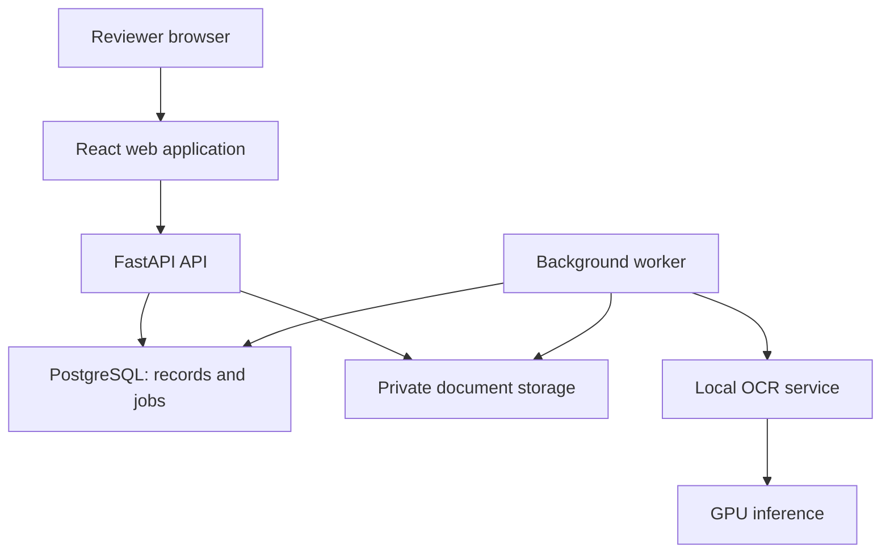

# AtharDoc — MVP system design

**Version:** 0.1 · **Date:** 14 September 2026 · **Status:** proposed design, ready to implement

This document turns the [engineering dossier](../architecture/OCR_99_Dossier_ingenierie_2026-09-14.md) into a bounded, three-week MVP. All scope, schedules, capacity envelopes, and acceptance thresholds below are proposed targets, not measured results. No application or infrastructure is deployed by this design.

## 1. Product outcome

**Upload a supplier invoice, inspect extracted fields beside their source, correct or confirm them, and export approved data.**

The first customer is an operations or accounting team currently retyping supplier documents into spreadsheets or an ERP. The first user is the person performing that entry and checking totals.

The first milestone is a review-assisted invoice workflow. Delivery-note extraction and manual linking are a stretch milestone. Automated purchase-order/invoice/delivery-note reconciliation remains the next product increment.

| Working assumption | MVP decision |
| --- | --- |
| Delivery | 15 engineering days, one engineer, with a customer reviewer available |
| Pilot | One organization per deployment; 2–5 users; up to five agreed supplier layouts |
| Languages | Printed French first; English included only where represented in the pilot corpus; Arabic evaluated separately after this milestone |
| Volume | Planning envelope: 100 documents / 500 pages per day; measure before committing capacity |
| Input | PDF, JPEG, PNG; one business document per upload; 20 MiB and 20 pages maximum |
| Output | Approved invoice JSON and a fixed-column CSV |
| UI | French interface with translation keys for later languages |
| Deployment | Private pilot; local inference on hardware authorized for this project |
| Automation | Human approval required for every document in v0.1 |

The milestone depends on access to documents, annotations, a GPU endpoint, and login infrastructure. If these are unavailable, deliver the same workflow against fixtures and report that the real-data pilot is blocked.

## 2. Scope and exclusions

| Priority | Deliverable | Meaning of done |
| --- | --- | --- |
| P0 | Login and roles | An authorized reviewer can work; a viewer cannot change or approve data |
| P0 | Upload and document inbox | Uploads persist, progress is visible, and unsupported files get actionable errors |
| P0 | Native parsing and OCR | Every page is accounted for; raw results and processing versions are retained |
| P0 | Invoice field extraction | Bounded supplier templates produce editable fields with evidence references |
| P0 | Review workspace | Clicking a field highlights its source; corrections are versioned |
| P0 | Validation and approval | Missing or conflicting critical fields block approval |
| P0 | JSON/CSV export | Export includes the exact approved revision and approval origin |
| P0 | Recovery and audit | Worker restarts do not lose accepted jobs or duplicate published results |
| P1 | Delivery notes | Extract supplier, delivery-note number/date, and an optional purchase-order reference |
| P1 | Manual document links | Reviewer links a delivery note to an invoice; reference mismatches are displayed |

**After v0.1:** generalized line-item tables, automatic three-way matching, ERP writeback, emails/WhatsApp ingestion, billing, shared SaaS tenancy, public API keys, webhooks, document chat/RAG, handwriting, Arabic production commitments, fine-tuning, learned confidence calibration, and automatic approval.

Credit notes, multiple invoices merged into one PDF, encrypted PDFs, and unsupported currencies/layouts are explicitly outside the first acceptance contract. Users can inspect and reject unsupported documents; the app does not silently interpret them as normal invoices.

## 3. The user experience

### Screen 1 — Documents

A compact table shows filename, supplier, document type, upload time, processing state, review state, and blocker count. Filters: processing, needs review, approved, rejected, failed.

Actions: upload, open, retry a failed run, download an approved export. Show text labels alongside status colors. Batch upload is a convenience built from independent per-file submissions; one bad file does not invalidate the batch.

### Screen 2 — Review

The desktop workspace has three regions:

- **Left:** page thumbnails and page navigation.
- **Center:** a rendered page image with zoom and evidence highlights.
- **Right:** fields grouped into supplier, document identity, dates, and totals; validation messages appear beside the affected field.

Clicking a value selects its source region. Changing a value requires retaining a supporting source region or selecting one on the page. Users can mark a field absent, illegible, or ambiguous instead of inventing a value.

Primary actions: **Save draft**, **Approve**, **Reject**. Approval summarizes unresolved blockers and uses an explicit button; it is never triggered by saving. Keyboard navigation and a visible unsaved-change indicator are part of P0.

Show useful reasons such as “two possible invoice numbers” or “total does not match.” Do not display uncalibrated model scores as percentage certainty.

### Screen 3 — Approved documents and exports

Select approved invoices, download CSV or JSON, and see who approved each revision and when. A new revision requires a new approval. Previously downloaded exports retain their original revision identifiers.

### Screen 4 — Pilot administration

An administrator can see configured users/roles, processing health, and the retention setting. User onboarding uses the configured identity provider; no self-service signup or billing screens.

## 4. Invoice contract

Supported v0.1 invoices use EUR and nonnegative totals. Add currencies or credit-note semantics through an explicit schema and test change.

| Field | Type | Approval requirement |
| --- | --- | --- |
| supplier_id | UUID from pilot supplier catalog | Required; reviewer confirms mapping |
| supplier_name | String | Required; preserve observed spelling separately |
| supplier_tax_id | String or null | Optional; no invented identifier |
| invoice_number | String | Required; preserve leading zeroes |
| invoice_date | ISO date | Required; ambiguous dates need review |
| due_date | ISO date or null | Optional |
| currency | Enum, initially EUR | Required; must be evidenced or reviewer-confirmed from an allowed source |
| net_total | Decimal string | Required |
| tax_total | Decimal string | Required; zero must be evidenced, not filled by default |
| gross_total | Decimal string | Required |
| purchase_order_reference | String or null | Optional |
| delivery_note_reference | String or null | Optional |

Do not calculate a missing critical field and present it as extracted. A derived amount may be displayed as a validation aid with explicit provenance.

Each field carries raw text, a normalized value, observation status, source references, extractor version, and review history. Machine and reviewer values remain distinguishable. Monetary arithmetic uses decimal types, never binary floating point.

Example field representation, with illustrative values only:

```json
{
  "field": "gross_total",
  "raw_text": "1 248,00 EUR",
  "normalized_value": "1248.00",
  "observation_status": "observed",
  "evidence": [
    {
      "page_number": 1,
      "region_id": "region-42",
      "bbox": [0.68, 0.82, 0.92, 0.88]
    }
  ],
  "origin": "ocr_template",
  "confidence": null,
  "review_state": "unreviewed"
}
```

Coordinates are normalized to [0,1] on the canonical upright rendered page, with top-left origin and box order x0, y0, x1, y1. Store the render dimensions and transformation from the original PDF page. A test must verify highlights after rotation and scaling.

A region-level box is acceptable when token-level alignment is unavailable; label its actual granularity. Never fabricate precise word boxes from plain Markdown.

## 5. Architecture

Use one Python application codebase with separate API and worker processes, one web frontend, and a separately deployable OCR backend.



| Component | Proposed choice | Responsibility |
| --- | --- | --- |
| Web | React, TypeScript, Vite | Inbox, review form, image overlays, exports |
| API | FastAPI, Pydantic | Authenticated document/review API and schema validation |
| Persistence | PostgreSQL, SQLAlchemy, Alembic | Records, revisions, audit events, durable job queue |
| Worker | Python process from the API codebase | Rendering, parsing, OCR calls, validation, cleanup |
| Original files and outputs | Storage interface; local private volume in development, private S3-compatible bucket for pilot | Original files, page images, raw OCR artifacts |
| Native PDF parsing | pdfplumber | Text and coordinates from usable PDF text layers |
| Page rendering | pypdfium2 candidate, pinned after smoke test | Canonical page images for OCR and review |
| OCR | Adapter around one selected self-hosted pipeline | Page/region text and evidence |
| Authentication | Existing OIDC provider with backend session handling | Login and provisioned identities |
| Metrics | Prometheus-compatible endpoint | Queue, errors, latency, throughput and review time |

This UI does not require server-rendered public pages; React's documentation includes a Vite-based from-scratch path for applications with that need. [React documentation](https://react.dev/learn/creating-a-react-app).

pdfplumber exposes PDF text geometry and is oriented toward machine-generated PDFs. Scanned or unreliable text layers require the OCR path. [pdfplumber](https://github.com/jsvine/pdfplumber).

PostgreSQL documents SKIP LOCKED as useful for multiple consumers of queue-like tables; use it only for claiming jobs here. Heavy processing lives outside API request processes. [PostgreSQL](https://www.postgresql.org/docs/current/sql-select.html), [FastAPI guidance](https://fastapi.tiangolo.com/tutorial/background-tasks/).

### OCR choice and relationship to the dossier

Start implementation with a **GLM-OCR two-stage adapter**, because it matches the pipeline already explored in this project context. Its SDK documents self-hosted layout detection and region recognition against vLLM/SGLang. Explicitly disable hosted/MaaS routing. [Official GLM-OCR repository](https://github.com/zai-org/GLM-OCR).

This is an implementation baseline, not a reversal of the dossier's recommendation to benchmark PaddleOCR-VL 1.6. Compare Paddle on the development set if the GLM baseline misses the pilot's needs or if a ready adapter makes the comparison inexpensive. Keep one production OCR backend in v0.1. No fine-tuning is required to reach the first workflow milestone.

Define an internal contract:

```text
parse_page(page_asset, options) -> {
  page_number,
  regions: [{id, bbox, text, kind, reading_order}],
  warnings,
  model_revision,
  processor_revision,
  duration_ms
}
```

The adapter translates provider-specific responses. Missing boxes, truncated output, and repetition are explicit warnings. An image is supplied by authorized internal bytes or a controlled internal path; clients cannot instruct the OCR backend to fetch arbitrary URLs.

Pin model revision, processor, layout weights, runtime image digest, and adapter version after a local smoke test. Do not infer runtime compatibility from a model name alone.

## 6. Processing and job reliability

### Pipeline

1. **Accept:** authenticate, enforce limits, inspect MIME signature, stream to a unique private object, and compute SHA-256.
2. **Register:** after storage completes, create document and queued run records in one database transaction; only then return HTTP 202.
3. **Prepare:** validate page count, reject encrypted/unsupported inputs, render pages in an isolated process, and record transformations.
4. **Parse:** inspect each page's text layer. Parse usable native text; OCR scanned pages and suspicious regions/pages. A mixed PDF may use both routes.
5. **Extract:** select one of the explicitly supported supplier templates using reviewer-selected supplier and validated anchors. Resolve fields from text, labels, and spatial rules.
6. **Validate:** record field/schema/business issues, evidence coverage, page completeness, and parse warnings.
7. **Publish for review:** atomically publish an immutable machine revision and mark the document ready for review.
8. **Review and export:** save new revisions; approve a specific revision; export only approved content.

Template extraction is deliberately bounded. A document with no reliable template match produces incomplete editable fields and a visible “unsupported layout” warning. No general-purpose LLM is required for this milestone. Generalized extraction can be evaluated later behind the same field contract.

### Two independent state axes

| Axis | States |
| --- | --- |
| Processing | queued → processing → succeeded or failed; retries create or requeue a run |
| Review | pending → approved or rejected; a new revision returns to pending |

Intermediate stage names belong to run progress. A successfully parsed document can still require review. Processing failure must never look like approved data. Export is an event, not a terminal document state, because users may export repeatedly.

### Durable queue

A worker claims a runnable job using a short database transaction, SKIP LOCKED, a lease expiration, and a unique claim token. Commit the claim before OCR; do not hold a database transaction during inference.

Use heartbeats and a lease reaper. Every completion update must match the active claim token and run generation, so an expired worker cannot overwrite a newer attempt. Processing is at least once; publishing a revision must be idempotent.

Initial proposed policy: up to three attempts for transient failures, with delayed retries; a bounded page timeout and a total run timeout. Permanent format errors are not retried. Exhausted jobs become visible failures with a safe reason code.

If storage succeeds but database registration fails, the object is an orphan: cleanup removes unreferenced staged objects after 24 hours. If registration succeeds but the HTTP response is lost, an idempotency key returns the existing document.

Reprocessing retains earlier runs and approvals as history. The current revision pointer changes only after the new run is published. The UI must warn that selecting a new current revision invalidates its current approval.

## 7. Data model

These are logical tables to implement through migrations; this document does not claim to provide executable DDL.

| Table | Key data and constraints |
| --- | --- |
| users | ID, unique OIDC issuer/subject, display name, role, enabled |
| sessions | Hashed opaque session ID, user ID, expiry, revoked timestamp |
| suppliers | ID, display name, optional tax identifier, enabled template configuration/version |
| documents | ID, uploader, original object key/hash, type, supplier, processing state, current revision ID, deletion marker |
| document_pages | Document ID + page number unique; dimensions, rotation/transform, image object key |
| processing_runs | Document ID, pipeline versions, status, timings, warning/error codes |
| jobs | Run ID + job kind unique; attempt, available_at, lease_until, claim token, status |
| extraction_revisions | Document ID, monotonic revision number unique, run ID, author/origin, schema version, payload JSONB, created_at |
| review_decisions | Document ID, exact revision ID, approver, approved/rejected outcome, reason, timestamp |
| audit_events | Actor, document/revision IDs, event kind, timestamp, minimal metadata |
| exports | Requester, selected approved revision IDs, format, timestamp, artifact hash |
| idempotency_requests | Actor + route + key unique; request fingerprint, resulting resource, expiry |
| document_links, P1 | Two document IDs, relationship, creator, timestamp; no self-links |

Payload JSONB contains typed fields, evidence, and validation issues. Validate with the versioned Pydantic schema before storage and again before approval/export. Originals and machine revisions are immutable within the retention lifecycle.

The first pilot uses a separate database and storage prefix/bucket per organization. Shared multi-tenant authorization is not implied by adding an organization_id column. Multi-tenant SaaS requires a later isolation design.

## 8. API surface

The browser uses the same origin for the web app and API. The MVP API uses authenticated sessions; it is not yet a public integration service.

| Method and route | Purpose / important behavior |
| --- | --- |
| GET /api/v1/me | Current user and permissions |
| GET /api/v1/suppliers | Configured pilot suppliers |
| POST /api/v1/documents | Multipart file, optional supplier/type; Idempotency-Key required; returns 202 and document ID |
| GET /api/v1/documents | Cursor pagination, filters and summary states |
| GET /api/v1/documents/{id} | Metadata, current revision, warnings and allowed actions |
| GET /api/v1/documents/{id}/pages/{page}/image | Authenticated canonical preview; no arbitrary object key input |
| GET /api/v1/documents/{id}/original | Authorized original download |
| GET /api/v1/documents/{id}/revisions/{revision} | Immutable extracted/reviewed payload |
| PATCH /api/v1/documents/{id}/fields | Save field changes as a new revision; If-Match required |
| POST /api/v1/documents/{id}/decisions | Approve/reject a specified current revision; If-Match required |
| POST /api/v1/documents/{id}/retry | Queue permitted failed/reprocess run; idempotency protection |
| GET /api/v1/documents/{id}/audit | Authorized event history |
| POST /api/v1/exports | JSON/CSV for up to 100 explicitly approved revisions |
| DELETE /api/v1/documents/{id} | Admin deletion request; revokes serving immediately and queues cleanup |
| POST /api/v1/document-links, P1 | Manual invoice/delivery-note link |

Return an ETag derived from the current revision. A missing required precondition returns 428; a stale If-Match returns 412. Return 409 when the current state conflicts with an otherwise valid action.

Use 413 for size limits, 415 for unsupported media, 422 for invalid field/schema data, and 503 when ingestion cannot durably accept work. Errors have stable codes, request IDs, and user-safe messages.

A reviewer cannot approve unresolved critical fields, a page-incomplete result, or unresolved blocking validation failures. v0.1 has no “force approve” escape hatch; reject or correct the document.

For progress, poll only active jobs every two seconds with backoff when the tab is hidden. SSE is a later optimization if polling causes a measured problem.

CSV exports neutralize formula-triggering text cells while preserving typed amounts. JSON retains the original text, source references, schema version, pipeline revision, approved revision, approval origin, reviewer, and time.

## 9. Validation and confidence policy

| Check | Initial behavior |
| --- | --- |
| Required fields missing, ambiguous, or illegible | Block approval |
| Page missing, render failed, truncated OCR | Block approval |
| net_total + tax_total differs from gross_total by more than EUR 0.02 | Block approval under this bounded invoice contract |
| Competing candidates for a critical value | Require reviewer selection with evidence |
| Missing evidence for a critical value | Require source selection; otherwise block |
| Unsupported currency/layout/type | Mark unsupported; require rejection or later supported processing |
| Same supplier + invoice number already approved | Block until duplicate case is resolved; do not silently merge records |
| Due date precedes invoice date | Warning requiring acknowledgement |
| Optional field absent | Preserve null; do not treat as extraction failure |

The EUR 0.02 tolerance is a pilot rule, not a universal accounting rule. Invoices involving unsupported adjustments, multiple totals, or ambiguous tax treatment are rejected from this bounded contract.

All v0.1 approvals are human approvals. Store confidence as null unless a genuinely calibrated value exists. Internal heuristic signals can prioritize review, but they are neither probabilities nor auto-approval authority.

Later automatic approval requires a frozen policy, independent acceptance data, a stated minimum coverage, and the dossier's statistical gate. Human-corrected results must never be reported as the OCR engine's own accuracy.

## 10. Deployment and operational envelope

### Development

A proposed Compose setup contains web, API, worker, and PostgreSQL. A mounted private volume implements the storage interface. A fixture OCR adapter supports CPU-only development; a real local OCR endpoint is configured separately.

### Private pilot

Use the same containers on an authorized environment. If a suitable Kubernetes cluster is available, package the app with one Helm chart and deploy through ArgoCD. KServe/vLLM can host the OCR model, but the application calls the adapter contract and does not depend on Kubernetes APIs.

Proposed starting allocation, subject to measurement:

| Resource | Initial planning allocation |
| --- | --- |
| Application/worker host | 8 vCPU, 16 GiB RAM |
| GPU inference | One 24 GiB GPU as the first capacity test; 16 GiB only after a constrained smoke test |
| Worker concurrency | One active document; bounded region concurrency inside OCR |
| Database | Small PostgreSQL instance with backup storage |
| Object storage | Start with 100 GiB quota; measure actual bytes/document and retention needs |

No H100 or fine-tuning GPU is needed by the design itself. Actual GPU fit depends on the selected runtime, resolution, context length, and concurrent regions. These allocations are estimates, not compatibility guarantees.

The first pilot tolerates a GPU outage by queuing work and showing degraded processing. It has no high-availability SLA. Separate production capacity, redundancy, and recovery objectives follow measurements.

Metrics: queue depth/oldest age, run success/failure, retries, OCR seconds/page, native-page fraction, GPU memory/utilization where available, review seconds/document, critical-field corrections, approvals, and export failures. Do not put filenames, supplier names, or extracted values into metric labels.

## 11. Access, document handling, and retention

- Roles: admin manages pilot users/configuration and deletion; reviewer edits/approves/exports; viewer reads only.
- OIDC login uses a vetted client with state/nonce validation. Store opaque server-side sessions; cookies are Secure, HttpOnly, SameSite; protect modifying requests against CSRF.
- Every route authorizes the requested object, including previews, originals, audit and export. Storage is private and has no anonymous listing.
- Run renderers with CPU/memory/time limits, bounded raster dimensions, no network, and no unnecessary filesystem access. Treat PDF text and OCR content as untrusted data; never execute embedded instructions.
- Render document previews as images. Escape extracted text; do not inject OCR HTML or Markdown into the UI.
- Supply inference credentials through deployment secrets. Restrict worker/inference network destinations and disable cloud OCR fallback.
- Retention proposal: 30 days for original documents, previews and extraction payloads; configurable for the pilot. Operational audit metadata is minimized and retained separately for a proposed 90 days.
- Deletion immediately blocks downloads and cancels/revokes live processing claims. Garbage collection removes originals, pages, outputs and cached export artifacts; a stale worker cannot republish a deleted document.
- Proposed backups: nightly, 7-day retention, with a restore exercise before external pilot use. Tombstones must be reapplied after restore so deletion does not accidentally restore user access.

These are product defaults to configure with the pilot, not claims of regulatory certification. Data sharing for training is a separate decision; corrections are not automatically pooled into a reusable training dataset.

## 12. Evaluation and release criteria

### Data

Before tuning extraction rules, assemble a proposed 150-document pilot corpus with usage permission. Use 100 development documents and 50 sealed acceptance documents, split by document identity and near-duplicate clusters. For these supported suppliers, hold out later documents to test the intended known-layout workflow. This does not establish generalization to unseen suppliers.

Double-check critical labels in the sealed set. Include multipage and mixed native/scanned documents, rotations, faint text, repeated references and different date/number formatting. Keep an additional unsupported/corrupt set for rejection tests. Do not change the sealed set or thresholds after inspecting results without recording a new evaluation round.

### Proposed gates

| Area | Release criterion |
| --- | --- |
| Core workflow | Upload → processing → review → approval → exact revision export works for each supported type |
| Extraction usefulness | At least 90% exact match across predeclared critical field slots on in-scope acceptance invoices, counting missing fields as errors; publish per-field and per-layout counts |
| Business value | Median review/entry time at least 50% lower than manual entry on at least 30 comparable invoices; counterbalance task order to limit learning effects |
| Evidence | Every non-null approved critical field has a valid source reference checked against the rendered page |
| Human-approved output | Report document exact-match and error counts separately from raw extraction; investigate every critical error |
| Responsiveness | Planning target p95 ≤60 seconds upload-to-review for 1–3 page documents at five concurrent submissions on the recorded pilot hardware |
| Reliability | Kill a worker during OCR; recover without lost accepted jobs, duplicate current revisions, or stale-worker overwrite |
| Review concurrency | Two reviewers editing/approving the same revision cannot silently overwrite each other |
| Access control | Viewer writes and unauthorized preview/export/download requests fail |
| Export | JSON schema validates; CSV handles decimal values, Unicode, delimiters and formula-leading text |
| Recovery | Restore database and document storage; verify approved revision links and deletion tombstones |

Measure processing, queueing, and review time separately. Report hardware, runtime/model revisions and test composition with results. The small acceptance corpus demonstrates workflow utility and catches regressions; it cannot certify a universal 99% accuracy guarantee.

If usefulness misses the target, either narrow the supported layouts or improve extraction before calling the workflow a successful pilot. Manual editing alone is not evidence of useful automation.

## 13. Three-week implementation backlog

| Day | Work | Demonstrable outcome |
| --- | --- | --- |
| 1 | Confirm field contract and five layouts; establish fixtures, repository scaffold and migrations | Schema and document lifecycle agreed; stack starts locally |
| 2 | Connect one authorized OCR backend; render sample pages; test native geometry | Real document returns text, regions and provenance |
| 3 | OIDC/session integration, roles, upload/storage and job registration | Authorized upload returns a durable document ID |
| 4 | Worker leases/retries and page pipeline | Queued upload reaches a reviewable machine revision |
| 5 | Inbox, progress and useful failures | First upload-to-result demonstration |
| 6 | Invoice template extractors and decimal/date normalization | Editable typed fields from supported samples |
| 7 | Page viewer, field selection and evidence overlays | Click a field to inspect its source |
| 8 | Revisioned editing, optimistic concurrency and draft saving | Corrections survive reload and conflicts are visible |
| 9 | Validation, approval/rejection and audit | Only eligible revisions can be approved |
| 10 | JSON/CSV exports | First complete invoice-to-export demonstration |
| 11 | Recovery, document authorization and input-limit checks | Core failure modes are exercised |
| 12 | Sealed evaluation and timed review sessions | Measured accuracy/usefulness and latency report |
| 13 | Fix acceptance blockers; P1 delivery notes only if P0 is stable | Stable invoice MVP; optional linked delivery-note demo |
| 14 | Pilot packaging, backups/restore and metrics | Repeatable private deployment |
| 15 | Pilot walkthrough, defect triage and next-sprint decision | Explicit release/go-no-go record |

If time is lost, cut P1 first. Do not cut revision safety, access control, evidence, or release evaluation. The schedule assumes familiar tools and ready dependencies; it is an estimate rather than a guaranteed delivery date.

## 14. Proposed repository layout

These paths are implementation targets, not files that already exist.

| Path | Contents |
| --- | --- |
| apps/web/ | React UI and browser workflow tests |
| apps/backend/athardoc/api/ | Routes, sessions and permission checks |
| apps/backend/athardoc/domain/ | Invoice contract, validations and review transitions |
| apps/backend/athardoc/pipeline/ | Native parser, OCR adapters and template extractors |
| apps/backend/athardoc/worker/ | Queue, lease handling and cleanup |
| apps/backend/migrations/ | Alembic schema changes |
| tests/fixtures/ | Small synthetic or explicitly redistributable samples |
| tests/integration/ | Queue recovery, approvals, exports and authorization |
| evaluations/ | Dataset manifests and measurement scripts; no private documents |
| deploy/compose/ | Local stack |
| deploy/helm/ | Optional pilot chart |
| docs/product/ | MVP design and future product decisions |
| docs/architecture/ | Engineering research and architectural decisions |

## 15. Decisions for implementation kickoff

The proposed defaults are sufficient to begin scaffolding. Before processing real customer data, resolve:

1. Which pilot organization and supplier layouts are available?
2. Which GPU endpoint and storage are authorized for AtharDoc?
3. Which identity provider will the pilot use?
4. Who supplies and arbitrates the 150 evaluation documents?
5. Does the buyer need header export first, or is line-level reconciliation indispensable?

If line-level reconciliation is indispensable, re-scope and re-estimate before implementation: table alignment, partial deliveries, unit conversion and purchase-order truth are separate requirements.

**First engineering slice:** one supported invoice → durable job → evidence-backed fields → manual approval → JSON export.
